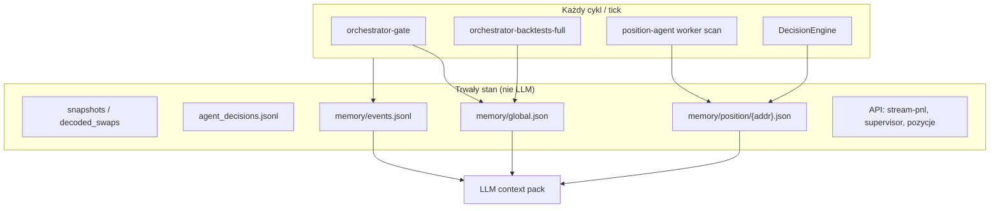

# Plan: rolling memory + orkiestrator (warstwa decyzyjna)

**Status:** plan produktowo-techniczny — **implementacja nie rozpoczęta** (2026-05-20).

**keywords:** rolling-memory, agent-memory, position-agent, orchestrator, decision-layer, global.json, events.jsonl, AgentLlmContext, gate_health, situational-awareness, restart-safe, LLM optional

**Powiązane:**

- [`MASTER_IMPLEMENTATION_PLAN.md`](MASTER_IMPLEMENTATION_PLAN.md) — nadrzędna kolejność fal i PR.
- [`AI_AGENT_LAYER.md`](AI_AGENT_LAYER.md) — trzy powierzchnie „agenta”.
- [`DECISION_LAYER.md`](DECISION_LAYER.md) — wizja orkiestratora, fazy, rejestr zdolności §1b.
- [`IMPLEMENTATION_PLAN_DECISION_LAYER.md`](IMPLEMENTATION_PLAN_DECISION_LAYER.md) — fazy gate → symulacje → raport → apply.
- [`FUNCTIONAL_SPECIFICATION.md`](FUNCTIONAL_SPECIFICATION.md) §8 — stub normatywny decision layer.

---

## 1. Problem i założenie

Operator i ewentualny LLM **nie mogą polegać na sesji czatu** — okno kontekstu jest krótkie, drogie i ginie po restarcie procesu.

**Założenie produktowe:**

> Pamięć operacyjna żyje **poza modelem** (pliki + DB + JSONL + API). Przy każdym ticku system **odczytuje świeże dane**, aktualizuje **rolling snapshot**, opcjonalnie woła LLM z **gotowym packiem kontekstu**.

To **nie** jest „jeden LLM z ciągłą świadomością” — to **system operacyjny z audytem**, gdzie LLM (jeśli włączony) jest warstwą komentarza, nie źródłem prawdy o rynku ani o PnL.

---

## 2. Rekomendacja nadrzędna

| Warstwa | Rola | LLM |
| ------- | ---- | --- |
| **Rdzeń decyzyjny** | gate, symulacje, `DecisionEngine`, apply przez `AgentDecision` | **Nie** |
| **Rolling memory** | snapshoty global + pozycja (+ później strategia) | **Nie** (regułowy `rolling_summary`) |
| **Position Agent UI** | czat, skan, supervisor | **Opcjonalnie** — komentarz na packu pamięci |

**Kolejność wdrożenia:** najpierw orkiestrator (deterministyczny), potem rolling memory (global + pozycja), potem podpięcie LLM, na końcu strategia + shadow what-if.

---

## 3. Architektura pamięci (docelowa)



### 3.1 Katalog plików

| Ścieżka | Scope | Kiedy update |
| ------- | ----- | ------------ |
| `data/agent/memory/global.json` | środowisko, gate, ostatni FULL | po `orchestrator-gate`, `orchestrator-backtests-full` |
| `data/agent/memory/position/{address}.json` | jeden LP stream | po worker scan, rebalance, (opcj.) czat operatora |
| `data/agent/memory/strategy/{strategy_id}.json` | polityka strategii | **faza 4** — po logu `DecisionEngine` |
| `data/agent/memory/events.jsonl` | audyt ticków (append-only) | każdy update powyższych |

Env (propozycja): `CLMM_AGENT_MEMORY_DIR` — domyślnie `data/agent/memory` (obok istniejącego `CLMM_AGENT_DATA_DIR`).

---

## 4. Kontrakt plików (skrót)

### 4.1 `global.json` (schema_version 1)

Pola min.:

- `updated_ts_utc`
- `data_quality`: `last_gate_outcome`, `last_gate_run_id`, `decode_ok_pct_min`, `snapshot_max_age_minutes`, `no_go_reason`
- `last_full_backtest`: `job_id`, `winner_width_pct`, `winner_metric`, `outcome` (opcjonalnie)
- `active_pools_curated`, `open_positions_count`, `active_strategies_count`
- `rolling_summary` — **regułowy** tekst (szablony + liczby), max ~500 znaków

**Źródła:** ostatni wiersz `agent_decisions.jsonl` z `kind: gate_health` / `api_backtests_full`; API liczników; curated list.

### 4.2 `position/{address}.json` (schema_version 1)

Pola min.:

- `position_address`, `pool_id`, `protocol`, `strategy_id`, `updated_ts_utc`
- `supervisor`: skrót z `GET /positions/{address}/agent/supervisor` (net, rebalance_count, elapsed)
- `range`: `width_pct`, `in_range`, `distance_to_edge_pct` (best-effort z API pozycji)
- `last_scan`: `ts_utc`, `recommendations[]`
- `last_operator_questions[]` — ostatnie 3 pytania user z `position_agent_state.json`
- `rolling_summary` — regułowy

### 4.3 `events.jsonl`

Jeden wiersz JSON na tick, np.:

```json
{"ts_utc":"...","scope":"position","scope_id":"addr...","event":"scan","detail":{"rec_count":3}}
{"ts_utc":"...","scope":"global","scope_id":"*","event":"gate","detail":{"outcome":"ok"}}
```

Przy budowaniu packa LLM: ostatnie **5–20** eventów dla danego scope — nie cały plik.

### 4.4 LLM context pack (rozszerzenie `AgentLlmContext`)

Propozycja pól (faza 3):

- `memory_global_summary`
- `memory_position_summary`
- `recent_events[]`
- `data_quality_note`
- `constraints[]` — np. `no_apply_without_agent_decision`, `fee_proxy_not_accounting_truth`

**Bez:** surowych JSONL snapshotów, pełnego `backtest-optimize`, całej historii czatu (max tail 3–5 wiadomości).

---

## 5. Fazy wdrożenia

### Faza O1 — Orkiestrator (bez LLM, bez memory)

**Cel:** domknąć pętlę analizy deterministycznej.

| # | Działanie | Stan dziś |
| - | --------- | --------- |
| O1.1 | `orchestrator-gate` → append `gate_health` | **Zaimplementowane** |
| O1.2 | `orchestrator-backtests-full` → append `api_backtests_full` | **Zaimplementowane (MVP)** |
| O1.3 | Jeden raport rankingowy (winner vs obecny `width_pct`) + alert/UI | **Do zrobienia** |
| O1.4 | Harmonogram (Task Scheduler / cron): ingest → gate → (opcj.) FULL | **Operacyjnie** |

**Kryterium sukcesu:** co 4–24 h jeden audytowalny wynik: gate OK/NO-GO + opcjonalnie ranking wariantów.

**Code pointers:** `crates/cli/src/orchestrator_gate.rs`, `orchestrator_api_full.rs`, `crates/api/src/handlers/data.rs` (`agent/decisions`).

---

### Faza M1 — Rolling memory (global + pozycja)

**Cel:** restart-safe „karta stanu” bez LLM.

| # | Działanie | Deliverable |
| - | --------- | ----------- |
| M1.1 | Moduł `agent_memory` (read/write JSON, append events) | `crates/api/src/services/agent_memory.rs` (lub wspólny helper w `clmm-lp-data` jeśli CLI też update) |
| M1.2 | Hook po gate / FULL → `global.json` | CLI lub API callback po append do `agent_decisions.jsonl` |
| M1.3 | Hook w `run_periodic_scan_tick` → `position/{addr}.json` | supervisor + scan + regułowy summary |
| M1.4 | Testy: pusty katalog, merge idempotentny, restart odczytuje stan | `#[cfg(test)]` w module |

**Celowo pominięte w M1:** `strategy/{id}.json` — brak spójnego logu reason z `DecisionEngine`.

**Kryterium sukcesu:** restart API nie resetuje widoku; pliki istnieją i są aktualne po gate i worker scan.

---

### Faza M2 — LLM context pack (opcjonalny)

**Cel:** Position Agent odpowiada w kontekście pamięci, nie pustego promptu.

| # | Działanie |
| - | --------- |
| M2.1 | Rozszerzyć `AgentLlmContext` w `models.rs` |
| M2.2 | `generate_agent_reply` — wczytać pack z memory przed wywołaniem providera |
| M2.3 | UI (opcj.): read-only panel „Agent memory” na stronie pozycji |

Domyślnie `CLMM_AGENT_LLM_MODE=disabled` — memory działa niezależnie.

---

### Faza M3 — Strategia + shadow what-if

**Warunek wejścia:** log hold/rebalance z executora; stabilny ranking z O1.

| # | Działanie |
| - | --------- |
| M3.1 | `strategy/{id}.json` — params, last optimize, last engine action |
| M3.2 | Porównanie real vs N wariantów symulacji ([`DECISION_LAYER.md`](DECISION_LAYER.md) faza 2–3) |
| M3.3 | LLM tylko do raportu human-readable z **już policzonych** liczb |

---

## 6. Macierz scope (kto co widzi)

| Tick / akcja | Global | Strategy | Position |
| ------------ | ------ | -------- | -------- |
| `orchestrator-gate` | update | — | — |
| Worker scan | read | read (faza M3) | update |
| Operator czat | read (1 linia) | read (M3) | read + tail czatu |
| Apply optimize | read | update (M3) | pozycje strategii |
| DecisionEngine rebalance | — | update (M3) | update |

---

## 7. Czego nie robić (na tym etapie)

| Opcja | Powód |
| ----- | ----- |
| RAG / wektorowa baza | strukturalne dane wystarczają; koszt i szum |
| Fine-tuning | nie zastępuje pamięci runtime |
| LLM w pętli rebalance | brak deterministycznego audytu |
| Jeden blob pamięci globalnej dla wszystkiego | szybko nieaktualny |
| Autonomiczne tx (DECISION_LAYER faza 5) | przed zaufaniem do logów i guardraili |

---

## 8. Minimalny pierwszy PR (slice M1)

Szacunek: **3–5 plików Rust** + ten dokument.

1. `agent_memory.rs` — IO + merge + `rolling_summary` regułowy (szablony)
2. Wywołanie z `position_agent_service::run_periodic_scan_tick`
3. Wywołanie z `orchestrator_gate` / `orchestrator_api_full` (lub wspólna funkcja czytająca ostatni wiersz JSONL)
4. Test jednostkowy merge + events append
5. Wpis w [`ENGINEERING_NOTES.md`](ENGINEERING_NOTES.md)

**Poza scope pierwszego PR:** UI panel, strategia, LLM pack (M2).

---

## 9. Alternatywy (kontekst decyzyjny)

| Podejście | Kiedy sensowne | U nas |
| --------- | -------------- | ----- |
| A. Tylko reguły + pliki | decyzje tx, audyt | **rdzeń** |
| B. Rolling snapshot | ciągłość bez LLM | **M1 — rekomendowane** |
| C. Event sourcing | pełna historia zmian | `events.jsonl` + istniejący `agent_decisions.jsonl` |
| D. RAG | dużo tekstu niestrukturalnego | później, opcjonalnie |
| E. Agent framework (graf) | wiele kroków async | gdy pełny orkiestrator urośnie |
| F. Fine-tuning | styl, nie fakty | **nie teraz** |

---

## 10. Powiązanie z istniejącym kodem

| Istniejący element | Rola w planie |
| ------------------ | ------------- |
| `data/agent/position_agent_state.json` | historia czatu UI; tail pytań → position memory |
| `data/agent/agent_decisions.jsonl` | źródło prawdy gate/FULL → global memory |
| `GET …/agent/supervisor` | liczby do position memory |
| `run_periodic_scan_tick` | trigger update position memory |
| `AgentLlmContext` | docelowy nośnik packa (M2) |
| `DecisionEngine` | live bot — **bez** LLM; strategia memory w M3 |

---

## Document status

| Field | Value |
| ----- | ----- |
| Role | Implementation plan for rolling memory + recommended rollout order |
| Created | 2026-05-20 |
| Author | product/architecture (sesja planowania) |
