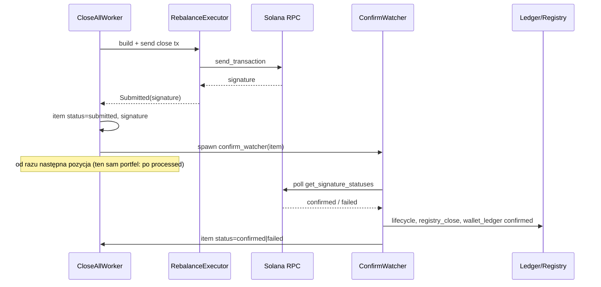

# Close-all — faza send-first (plan implementacji)

**Status:** accepted (plan)  
**Data:** 2026-05-21  
**Dotyczy:** `POST /positions/close-all` (bulk / zamknij wybrane), **nie** domyślnie `DELETE /positions/{addr}` (single close)  
**Stan wyjściowy (2026-05-21):** P1 batch + UI + `skip_pre_collect` (1 tx/pozycja) + równoległe grupy portfeli; worker nadal **blokuje** na `send_and_confirm` (~30–90 s/pozycję).

**Powiązane:** [`POSITIONS_CLOSE_ALL_IMPLEMENTATION_PLAN.md`](POSITIONS_CLOSE_ALL_IMPLEMENTATION_PLAN.md) §5.2 faza B, [`POSITIONS_PAGE_PERFORMANCE_PLAN.md`](POSITIONS_PAGE_PERFORMANCE_PLAN.md) (**współdzielony RPC / wolna lista**), [`IMPLEMENTATION_PLAN.md`](IMPLEMENTATION_PLAN.md) PR-12 (persystencja batch), [`WALLET_GL.md`](WALLET_GL.md), [`POSITION_REGISTRY.md`](POSITION_REGISTRY.md)

**keywords:** close-all, send-first, send_mode, confirm_async, bulk-close, batch-job, wallet-ledger, lifecycle, TransactionManager, positions-ui

---

## 1. Cel produktowy

Operator po kliknięciu **Zamknij wybrane** oczekuje zachowania jak w normalnej aplikacji:

| Oczekiwanie | Dziś (`confirm_sync`) | Docelowo (`send_first`) |
|-------------|------------------------|-------------------------|
| UI nie blokuje | Tak (202 + polling) | Tak |
| Widać postęp w sekundach | Słabo — licznik „w toku” stoi minuty | Status `submitted` + sygnatura w &lt;5 s |
| Można odejść od ekranu | Tak (job w tle) | Tak + jasny komunikat |
| Batch kończy się szybko | Nie — worker czeka confirm każdej pozycji | Worker wysyła kolejne tx; confirm równolegle w tle |
| Spójność księgi / registry | Po confirm | Po confirm (w tle), nie przy send |

**Metryka sukcesu:** dla 2 pozycji, 1 portfel — czas do `batch.status=done` **&lt; 2× czas send** (np. &lt;60 s przy zdrowym RPC), zamiast 2× pełny confirm sync (~3–6 min).

---

## 2. Co już mamy (reuse)

| Komponent | Plik | Uwagi |
|-----------|------|--------|
| Pole API `options.send_mode` | `crates/api/src/models.rs` | Wartości: `confirm_sync` (default), `send_first` — **niepodpięte** |
| `TransactionManager::send_transaction` + `wait_for_confirmation` | `crates/execution/src/transaction/manager.rs` | Gotowy podział send / confirm |
| `RpcProvider::send_transaction` | `crates/protocols/src/rpc/provider.rs` | Osobno od `send_and_confirm_transaction` (90 s) |
| Batch job + `items[]` + polling | `position_close_all.rs`, `Positions.tsx` | Rozszerzyć statusy + `signature` |
| `skip_pre_collect` / `execute_bulk_close_only` | `rebalance.rs`, `position_service.rs` | 1 tx/pozycję — **wymagane** z send-first |
| Wallet ledger pending → confirmed | `position_close_ops.rs` | Rozdzielić: pending+sig po send, confirmed po confirm |
| Lifecycle + registry po close | `ensure_execution_success` w `rebalance.rs` | Przenieść do `finalize_close_after_confirm` |

---

## 3. Architektura send-first

### 3.1 Przepływ (bulk only)



### 3.2 Tryby wykonania (enum)

```rust
// crates/execution/src/transaction/delivery.rs (nowy, albo w manager.rs)
pub enum TxDeliveryMode {
    /// Dziś: send + confirm w jednym await (Orca executor).
    ConfirmSync,
    /// Bulk: send → zwrot signature; confirm w osobnym tasku.
    SendFirst,
}
```

**Zakres v1 send-first:**

- Włączone tylko gdy `CloseAllPositionsRequest.options.send_mode == "send_first"`.
- `DELETE /positions/{addr}` i strategie — **nadal** `ConfirmSync` (mniejsze ryzyko regresji).

### 3.3 Kolejność w grupie portfela (ważne)

Ten sam `fee_payer` **nie może** bezpiecznie wysłać dwóch tx z tym samym blockhashem/nonce równolegle.

**Polityka v1 (konserwatywna):**

1. **Send** tx dla pozycji N.
2. Zapisz `signature` + status `submitted`.
3. **Opcjonalnie** krótki wait: `processed` (nie `finalized`) — typ. 5–20 s, konfig `CLMM_SEND_FIRST_INTER_TX_SECS` (default 8).
4. Przejdź do pozycji N+1 (send).
5. **Confirm watcher** (finalized/confirmed) działa **równolegle** dla wszystkich wysłanych sygnatur.

Efekt: worker nie czeka 90 s × N; czeka krótko między sendami w grupie, a ciężki confirm idzie w tle.

**Później (P4):** durable nonce / wyższy limit równoległych sendów per portfel.

---

## 4. Maszyna stanów — `CloseAllBatchItem`

| Status | Znaczenie | Kiedy |
|--------|-----------|--------|
| `queued` | Zaplanowane | Plan batch |
| `submitted` | Tx wysłana, sygnatura znana | Po udanym `send_transaction` |
| `confirming` | (alias opcjonalny) | Można zlać z `submitted` lub użyć po `processed` |
| `confirmed` | On-chain OK + post-processing done | Po watcher + finalize |
| `failed` | Send lub confirm lub finalize error | `error` wypełnione |
| `skipped_unmanaged_signer` | Bez zmian | Preview/plan |
| `already_closed` | Bez zmian | Idempotent close |

**API/OpenAPI:** dodać `submitted` do `CloseAllItemStatus`; w `summary` liczyć `submitted`+`confirming` w `pending` (kompatybilność wstecz).

**UI:** etykiety PL: `wysłane (czekam confirm)`, link Solscan/explorer po `signature`.

---

## 5. Warstwy — co zmienić

### 5.1 `protocols` — Orca executor

**Plik:** `crates/protocols/src/orca/executor.rs`

| Zadanie | Opis |
|---------|------|
| SF-1a | `send_transaction_with_signers_only(...)` — build tx, `provider.send_transaction`, zwróć `ExecutionResult { success: true, signature, slot: None }` bez confirm |
| SF-1b | `close_position_send_first(...)` — jak `close_position`, ale pętla 6018 woła send-only; **bez** `maybe_auto_unwrap_wsol` przed confirm (unwrap w finalize lub po confirm) |
| SF-1c | Test jednostkowy: mock provider — send wywołane, confirm nie w ścieżce sync |

**Nie zmieniać** domyślnego `send_transaction_with_signers` (nadal send+confirm) dla open/swap/rebalance strategii.

### 5.2 `execution` — RebalanceExecutor + finalize

**Pliki:** `crates/execution/src/strategy/rebalance.rs`, `executor.rs`

| Zadanie | Opis |
|---------|------|
| SF-2a | `execute_bulk_close_send_first(...)` → send-only close, zwraca `SubmittedClose { signature, fee_quote, ... }` |
| SF-2b | Wydzielić `finalize_close_after_confirm(op_name, result, pool, position, ledger_*)` z ciała `ensure_execution_success` (lifecycle, registry_close, chain_history hook) |
| SF-2c | `ensure_execution_success` w trybie sync: validate → finalize (jak dziś) |
| SF-2d | `ConfirmWatcher::run(signature, ctx)` — `tx_manager.wait_for_confirmation` lub provider poll → przy OK wywołaj `finalize_close_after_confirm`; przy Err → failed |

**StrategyExecutor:** `execute_bulk_close_send_first` cienka nakładka (bez fee checkpoint pre/post przy bulk).

### 5.3 `api` — close ops + batch worker

**Pliki:** `position_close_ops.rs`, `position_close_all.rs`, `position_service.rs`

| Zadanie | Opis |
|---------|------|
| SF-3a | `ManualCloseLedgerContext.send_mode: TxDeliveryMode` |
| SF-3b | `execute_manual_close_send_first_with_wallet` — pending ledger **z signature** po send; **nie** usuwać z monitora / unlink strategii do confirm |
| SF-3c | `confirm_manual_close_background(state, ctx, submitted)` — confirmed ledger, monitor remove, strategy unlink, `spawn_chain_history_materialize_background` |
| SF-3d | `close_wallet_group`: jeśli `send_first` → pętla send + spawn watcher; jeśli `confirm_sync` → obecna ścieżka |
| SF-3e | `finish_job`: `done` dopiero gdy **wszystkie** watchery skończone (licznik `Arc<AtomicUsize>` lub drugi pass po join handles watcherów) |

**Batch completion:** worker główny kończy się po ostatnim **send**; status batch `running` → `confirming` → `done` gdy watchery = 0.

Nowy status batch (opcjonalny): `confirming` — wszystkie tx wysłane, czekamy na domknięcie.

### 5.4 `api` — modele i walidacja

**Plik:** `models.rs`, `handlers/position_close_all.rs`

```json
"options": {
  "skip_pre_collect": true,
  "send_mode": "send_first"
}
```

| Reguła | |
|--------|--|
| `send_first` dozwolone tylko dla `POST /positions/close-all` | |
| `send_first` + `skip_pre_collect: false` | Ostrzeżenie w logu lub 400 (zalecenie: wymusić skip_pre_collect=true przy send_first) |
| Nieznany `send_mode` | 400 |

### 5.5 Frontend

**Pliki:** `web/src/pages/Positions.tsx`, `web/src/lib/api.ts`, `i18n.tsx`

| Zadanie | Opis |
|---------|------|
| SF-4a | Domyślnie `send_mode: 'send_first'` w `closeSelectedRequest` (po wdrożeniu backendu) |
| SF-4b | Status `submitted` + link do eksplorera (`signature`) |
| SF-4c | Tytuł batch: „Wysyłanie / potwierdzanie w tle” gdy `batch.status === 'confirming'` |
| SF-4d | Toggle zaawansowany w confirm (opcjonalnie): „Tryb szybki (send-first)” — domyślnie włączony |

---

## 6. Podział na PR-y (kolejność)

**Uwaga (2026-05-21):** przed workerem send-first wdrożyć **PERF-PR1–4** z [`POSITIONS_PAGE_PERFORMANCE_PLAN.md`](POSITIONS_PAGE_PERFORMANCE_PLAN.md) — preview close-all dziś woła pełny `collect_monitored_position_addresses` nawet dla 2 zaznaczonych PDA i konkurruje z `GET /positions` o RPC.

| PR | Tytuł | Zakres | Szacunek | Zależności |
|----|--------|--------|----------|------------|
| **PERF-PR1** | Explicit close-all bez full monitor scan | `position_close_all.rs` | 0.5 dnia | — (**przed SF-PR3**) |
| **SF-PR1** | Orca send-only + `close_position_send_first` | `protocols/orca/executor.rs`, testy mock | 1–2 dni | — |
| **SF-PR2** | `finalize_close_after_confirm` + watcher szkielet | `execution/rebalance.rs`, `transaction/manager.rs` | 2 dni | SF-PR1 |
| **SF-PR3** | API bulk path: send_first w workerze + statusy batch | `position_close_all.rs`, `position_close_ops.rs`, `models.rs` | 2 dni | SF-PR2 |
| **SF-PR4** | UI: submitted/confirming + signature + domyślny send_first | `Positions.tsx`, `api.ts`, i18n | 0.5–1 dni | SF-PR3 |
| **SF-PR5** | Testy integracyjne + runbook | `doc/MULTI_WALLET_MANUAL_RUNBOOK.md`, testy api | 1 dzień | SF-PR4 |
| **SF-PR6** | (Opcjonalnie) Persystencja batch PR-12 | Postgres/JSONL — watchery przeżywają restart | osobno | IMPLEMENTATION_PLAN PR-12 |

**Rekomendowany merge:** SF-PR1 → SF-PR2 → SF-PR3 → SF-PR4 → SF-PR5; SF-PR6 równolegle lub po.

---

## 7. Testy i kryteria done

### 7.1 Testy automatyczne

| Test | Crate | Co sprawdza |
|------|-------|-------------|
| `close_position_send_first_does_not_block_on_confirm` | protocols / execution | Mock RPC: send OK, confirm nie wywołane w sync path |
| `finalize_close_writes_registry_on_confirm` | execution | Po mock confirm — registry_close row |
| `batch_send_first_item_submitted_then_confirmed` | api | Worker mock executor: item submitted &lt;1s, confirmed po watcher |
| `send_first_rejects_unknown_mode` | api | 400 dla `send_mode: "fast"` |

### 7.2 Manual (devnet / mały mainnet)

1. 2 pozycje, 1 portfel — `send_first` + `skip_pre_collect`.
2. W ciągu **&lt;15 s** obie pozycje mają status `submitted` i signature w UI.
3. W ciągu **&lt;3 min** batch `done`, pozycje znikają z `/positions`.
4. Wallet ledger: `pending` (sig) → `confirmed` per pozycja.
5. Registry: `registry_close` po confirm, nie po send.
6. Restart API **w trakcie** confirm — bez SF-PR6: batch znika, tx na chain zostają; operator sprawdza ledger (znany limit).

### 7.3 Done (faza send-first)

- [ ] `options.send_mode=send_first` działa end-to-end dla close-all.
- [ ] Single `DELETE /positions/{addr}` bez zmiany zachowania (confirm_sync).
- [ ] Czas batch 2 pozycji / 1 portfel typowo **&lt; ½** czasu confirm_sync (przy tym samym RPC).
- [ ] UI pokazuje signature i status per pozycja w &lt;10 s od startu.
- [ ] Wpis w `doc/BUGS.md` / `ENGINEERING_NOTES.md` po merge.

---

## 8. Ryzyka i mitigacje

| Ryzyko | Mitigacja |
|--------|-----------|
| Tx wysłana, confirm fail (timeout) | Item `failed` + retry manual z detail; ledger `failed`; batch partial OK |
| Send OK, operator myśli że zamknięte | UI: `submitted` ≠ `confirmed`; nie usuwać z listy monitora do confirm |
| Dwa sendy z jednego portfela — kolizja | Inter-tx wait na `processed` (§3.3); log przy błędzie blockhash |
| Restart API — utrata watcherów | SF-PR6 persystencja; do tego runbook: sprawdź sygnatury w ledger |
| Brak `bot_collect_fees` przy skip_pre_collect | Akceptowane przy mass exit (plan §5.2 C) |
| WSOL unwrap przed confirm | Przenieść unwrap do finalize po confirm |
| Strategia rebalance w trakcie | `pause_linked_strategies` przed batch (już jest) |

---

## 9. Poza zakresem (v1 send-first)

- Send-first dla **pojedynczego** close z UI szczegółów pozycji.
- Równoległe **send** z jednego portfela (durable nonce).
- Unsigned Phantom batch.
- Automatyczny retry send-first po confirm timeout (v2: jeden retry z fresh blockhash).

---

## 10. Rollout

| Etap | Flaga | Uwagi |
|------|-------|--------|
| Dev | `send_mode: send_first` w UI dev | Domyślnie po SF-PR4 |
| Prod | Env `CLMM_CLOSE_ALL_DEFAULT_SEND_MODE=confirm_sync` | Przełącz na `send_first` po 1 tygodniu manual QA |
| Fallback | Klient może wysłać `confirm_sync` | Stara ścieżka zostaje |

---

## 11. Aktualizacja dokumentów po implementacji

- [`POSITIONS_CLOSE_ALL_IMPLEMENTATION_PLAN.md`](POSITIONS_CLOSE_ALL_IMPLEMENTATION_PLAN.md) — §5.2: faza B = done, link tutaj.
- [`IMPLEMENTATION_PLAN.md`](IMPLEMENTATION_PLAN.md) — PR-12 + wiersz send-first.
- [`UI_REQUIREMENTS_PHASE1.md`](UI_REQUIREMENTS_PHASE1.md) — oczekiwany czas i statusy.
- [`doc/ENGINEERING_NOTES.md`](ENGINEERING_NOTES.md) — wpis z `keywords:` po merge SF-PR3+4.

---

## 12. Streszczenie dla operatora (PL)

Po wdrożeniu send-first:

1. Zaznaczasz pozycje → **Zamknij wybrane**.
2. W kilka sekund widzisz **„wysłane”** i link do transakcji.
3. Możesz **wyjść z ekranu** — serwer dokończy confirm i sprzątanie.
4. Po ok. 1–2 min (RPC) pozycje znikają z listy; w razie błędu — komunikat przy danym PDA.

To nie skraca czasu **potwierdzenia na blockchainie**, ale usuwa **puste czekanie** w aplikacji i przyspiesza wysłanie kolejnych pozycji w batchu.
