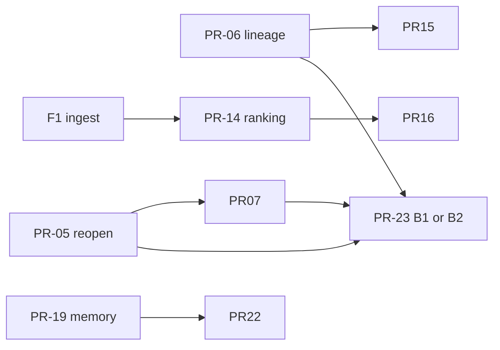

# Plan implementacji — wykonawczy

**Status:** aktywny backlog wdrożeń (2026-05-20).  
**Analiza i uzasadnienie priorytetów:** [`MASTER_IMPLEMENTATION_PLAN.md`](MASTER_IMPLEMENTATION_PLAN.md).

**keywords:** implementation-plan, execution-backlog, PR-slices, sprint, acceptance-criteria, F1-F5

---

## 1. Cel

Doprowadzić Bociarz LP do stanu, w którym operator **ufa** metrykom live, **widzi** rekomendacje z symulacji (bez autonomicznych tx) i **może** uruchamiać eksperymenty wielostategiczne — na stabilnym fundamencie danych on-chain.

**Zasady:**
- Małe PR-y (1 temat = 1 merge).
- Najpierw **stabilność live**, potem **orkiestrator**, potem **memory / experiment**.
- LLM opcjonalny; decyzje tx = reguły + symulacja + `AgentDecision`.

---

## 2. Harmonogram (5 fal)

| Fala | Nazwa | Czas | Blokuje |
| ---- | ----- | ---- | ------- |
| **F1** | Fundament danych | tydz. 1–2 | ranking, optimize między parami |
| **F2** | Stabilność live | tydz. 3–7 | experiment, shadow, zaufanie UI |
| **F3** | Decision layer MVP | tydz. 6–9 | reviewed apply, alerty |
| **F4** | Memory + produkt | tydz. 9–14 | ciągłość agenta, A/B live |
| **F5** | Research | równolegle | fee truth, multi-venue |

F1 (ops) może iść **równolegle** z F2 (kod) od tygodnia 1.

---

## 3. Backlog PR (kolejność merge)

### Fala 1 — Fundament danych (ops + minimalny kod)

| PR | Tytuł | Scope | Pliki / komendy | Done when |
| -- | ----- | ----- | --------------- | --------- |
| **PR-01** | Runbook ingest 24/7 | Dok + skrypt NSSM/Task Scheduler | `doc/TODO_ONCHAIN_NEXT_STEPS.md` A3–A5, `tools/` | `ops-ingest-loop` działa ≥48h bez ręcznej interwencji |
| **PR-02** | Decode rebuild + audit | Ops | `swaps-enrich-curated-all`, `swaps-decode-audit --save-report` | `% ok` ≥ 65% na curated pools (raport zapisany) |
| **PR-03** | Snapshot readiness guardian | Skrypt/cron A6 | `snapshot-readiness`, `snapshot-backtest-prep` | Okno `h24` ready w `data/backtest-snapshot-cache/` |
| **PR-04** | Gate w harmonogramie | Ops | `orchestrator-gate --fail-on-no-go` | Scheduler zapisuje wiersz do `agent_decisions.jsonl` |

**Owner:** operator + lekki PR dokumentacyjny/skryptowy. **Bez merge kodu Rust** w PR-01–04 (opcjonalnie).

---

### Fala 2 — Stabilność live (kod — priorytet P0)

| PR | Tytuł | Scope | Pliki | Testy / Done when |
| -- | ----- | ----- | ----- | ------------------- |
| **PR-05** | Reopen po rotacji | BUG-20260410-06 | `crates/execution/src/strategy/rebalance.rs`, pending-open, `executor.rs` | Po `close_kind=rotation` następuje `bot_open` w tej samej sesji; brak wiszących recovery >24h |
| **PR-06** | Lineage: poprawny parent chain | BUG-20260413-05 | `crates/api/src/services/position_stream_lineage.rs` | Golden: manual open ≠ kontynuacja obcej rotacji; bot rebalance łączy chain |
| **PR-07** | Reopen bez silent downsize | BUG-20260512-03 | `rebalance.rs`, `session_capital.rs` | Notional po reopen ≥ `target_usd × (1−ε)` lub log `session_cap_*` + test regresji |
| **PR-08** | Valuation ↔ lineage spójność | BUG-20260413-07, partial | `position_stream_pnl.rs`, `position_valuation.rs` | Performance value ≈ lineage baseline (test istniejący rozszerzony) |
| **PR-09** | Session caps na reopen (domyślna ścieżka) | WALLET_SESSION plan | `session_capital.rs`, `rebalance.rs`, env/docs | Reopen respektuje `SessionMintCaps` bez ręcznego włączania flagi (po review polityki) |
| **PR-10** | PositionCreate: wallet race | BUG-20260413-06 | `web/src/pages/PositionCreate.tsx` | Salda zawsze dla `api-signer` przed open; brak flash wrong wallet |
| **PR-11** | Session GL na close/collect | UI gap | `web/src/pages/PositionDetail.tsx`, API handlers | `cost_session_id` jak w PositionCreate |
| **PR-12** | Close-all job persistence | In-memory → PG/JSONL | `crates/api/src/services/position_close_all.rs` | Restart API nie gubi batch w stanie `running` |
| **PR-13** | UI regression: collect/swap | BUG-20260410-04 | `web/src/` testy | Test: backend message passthrough |

**Kolejność merge:** PR-05 → PR-06 → PR-07 (P0), potem PR-08–13 równolegle gdzie możliwe.

---

### Fala 3 — Decision layer MVP

| PR | Tytuł | Scope | Pliki | Done when |
| -- | ----- | ----- | ----- | --------- |
| **PR-14** | Raport rankingowy post-FULL | IMPLEMENTATION_PLAN faza 2 | `crates/cli/src/orchestrator_api_full.rs`, `data/reports/` | JSON/MD: winner + metryki + **Δ vs obecny width_pct** |
| **PR-15** | Composite real vs sim | IMPLEMENTATION_PLAN faza 3 | Nowy moduł CLI lub API handler | Raport = tabela optimize + 1 wiersz `stream-pnl`/supervisor |
| **PR-16** | UI: ostatni gate + raport | Dashboard lub DataQuality | `web/src/pages/DataQuality.tsx` | Operator widzi outcome, link do raportu, NO-GO reason |
| **PR-17** | Runbook apply-optimize | Dok + UI hint | `doc/`, `StrategyDetail.tsx` | Jawna ścieżka `approved: true/false`, `optimization_busy` |
| **PR-18** | Multi-variant CLI (opc.) | Pętla lokalna bez FULL | `crates/cli/` nowy subcommand | Ten sam input → identyczny ranking 2× (determinizm) |

**Zależność:** PR-14 wymaga F1 gate OK ( sensowne dane ).

Szczegóły kontraktu: [`IMPLEMENTATION_PLAN_DECISION_LAYER.md`](IMPLEMENTATION_PLAN_DECISION_LAYER.md).

---

### Fala 4 — Memory + produkt równoległy

#### 4A — Rolling memory (zawsze)

| PR | Tytuł | Scope | Pliki | Done when |
| -- | ----- | ----- | ----- | --------- |
| **PR-19** | Agent memory M1 — moduł IO | AGENT_ROLLING_MEMORY M1 | `crates/api/src/services/agent_memory.rs` | read/write `global.json`, `position/{addr}.json`, `events.jsonl` |
| **PR-20** | Hook gate/FULL → global | | `orchestrator_gate.rs`, hook w API | Po gate/FULL `global.json` aktualny |
| **PR-21** | Hook worker scan → position | | `position_agent_service.rs` | Po scan plik position memory + 1 linia events |
| **PR-22** | LLM context pack (opc.) | M2 | `models.rs`, `position_agent_llm.rs` | LLM dostaje pack; domyślnie `disabled` OK |

Szczegóły: [`AGENT_ROLLING_MEMORY_PLAN.md`](AGENT_ROLLING_MEMORY_PLAN.md).

#### 4B — Wybierz **jedną** ścieżkę produktową

**Opcja B1 — Experiment launcher E2E** (rekomendowane jeśli priorytet = szybkie A/B na live)

| PR | Tytuł | Done when |
| -- | ----- | --------- |
| **PR-23B** | Backend batch registry | `POST /experiments/batches` + status poll |
| **PR-24B** | UI lista experimentów | `/experiments` — nie tylko localStorage |
| **PR-25B** | Server-side launch orchestrator | Retry/resume; klient tylko start/status |

Spec: [`MULTI_STRATEGY_EXPERIMENT_LAUNCHER.md`](MULTI_STRATEGY_EXPERIMENT_LAUNCHER.md).

**Opcja B2 — Shadow strategies (ROADMAP)**

| PR | Tytuł | Done when |
| -- | ----- | --------- |
| **PR-23S** | Model assignment live/shadow | DB + API CRUD |
| **PR-24S** | Shadow evaluator tick | DecisionEngine dry-run per shadow |
| **PR-25S** | UI porównanie live vs N shadow | PositionDetail panel |

Spec: [`ROADMAP.md`](ROADMAP.md) §40–75.

**Gate decyzyjny:** przed PR-23 — wybór B1 **lub** B2 (nie oba pełne ścieżki naraz).

---

### Fala 5 — Research (backlog, bez blokady F2–F4)

| PR | Temat | Dokument |
| -- | ----- | -------- |
| PR-26 | WebSocket → React Query invalidation | `web/src/App.tsx`, Layout |
| PR-27 | Event parsing Orca/Raydium/Meteora | `crates/protocols/src/events/` |
| PR-28 | `increase_liquidity` (bez close→open) | `rebalance.rs` |
| PR-29 | Bollinger / last-candle (jeśli brakuje w prod) | IMPLEMENTATION_PLAN_BOLLINGER |
| PR-30 | Settings ↔ runtime (API key, RPC) | `web/src/pages/Settings.tsx` |

---

## 4. Macierz zależności (skrót)

---

## 5. Kryteria „fala zamknięta”

| Fala | Checklist |
| ---- | --------- |
| **F1** | [ ] Gate OK ≥90% tygodnia [ ] Decode ≥65% [ ] Ingest loop 48h+ [ ] Prepared window h24 |
| **F2** | [ ] 0 open P0 bugs (reopen, lineage, downsize) [ ] Session GL spójne create/detail [ ] Close-all survives restart |
| **F3** | [ ] Raport dzienny winner vs current [ ] NO-GO bez rankingu [ ] UI pokazuje gate |
| **F4** | [ ] Memory pliki po gate/scan [ ] B1 **lub** B2 demo 3+ ramiona |
| **F5** | ciągły backlog — brak twardego gate |

---

## 6. Co robimy **teraz** (najbliższe 2 tygodnie)

| Tydzień | Operator (F1) | Dev (F2) |
| ------- | ------------- | -------- |
| **1** | PR-01–02: RPC + decode rebuild | PR-05: reopen po rotacji |
| **2** | PR-03–04: snapshot guardian + gate cron | PR-06 + PR-07: lineage + downsize |

**Nie zaczynać:** shadow (B2), LLM pack (PR-22), autonomiczny apply — przed zamknięciem F2 P0.

---

## 7. Mapowanie bugów → PR

| Bug | PR |
| --- | -- |
| BUG-20260410-06 reopen | PR-05 |
| BUG-20260413-05 lineage parent | PR-06 |
| BUG-20260512-03 downsize | PR-07 |
| BUG-20260413-06 wallet race | PR-10 |
| BUG-20260410-04 UI tests | PR-13 |

Aktualizuj [`BUGS.md`](BUGS.md) przy zamknięciu każdego PR.

---

## 8. Powiązane plany (szczegóły domenowe)

| Temat | Plik |
| ----- | ---- |
| Analiza dojrzałości | [`MASTER_IMPLEMENTATION_PLAN.md`](MASTER_IMPLEMENTATION_PLAN.md) |
| Orkiestrator (kontrakt JSON) | [`IMPLEMENTATION_PLAN_DECISION_LAYER.md`](IMPLEMENTATION_PLAN_DECISION_LAYER.md) |
| Rolling memory (schema plików) | [`AGENT_ROLLING_MEMORY_PLAN.md`](AGENT_ROLLING_MEMORY_PLAN.md) |
| Session capital executor | [`WALLET_SESSION_CAPITAL_EXECUTOR_PLAN.md`](WALLET_SESSION_CAPITAL_EXECUTOR_PLAN.md) |
| Close-all | [`POSITIONS_CLOSE_ALL_IMPLEMENTATION_PLAN.md`](POSITIONS_CLOSE_ALL_IMPLEMENTATION_PLAN.md) |
| Ingest ops | [`TODO_ONCHAIN_NEXT_STEPS.md`](TODO_ONCHAIN_NEXT_STEPS.md) |

---

## Document status

| Field | Value |
| ----- | ----- |
| Role | **Execution backlog** — konkretne PR-y i kolejność merge |
| Created | 2026-05-20 |
| Supersedes | — (uzupełnia MASTER, nie zastępuje planów domenowych) |
