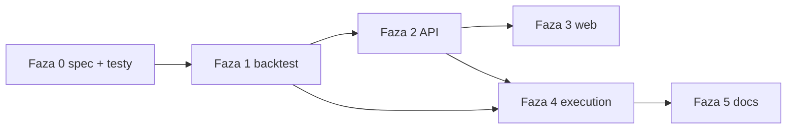

# Plan implementacji: strategie Bollinger i ostatnia świeca

**keywords:** strategy, bollinger, candle, backtest, backtest-optimize, StratConfig, StrategyMode, decision engine, api, web, snapshots

**Roadmap produktowa:** [`ROADMAP.md`](ROADMAP.md) (sekcja *Strategie CLMM: pasma Bollingera oraz kotwica na ostatniej świecy*).

---

## Nazewnictwo w repo

| Pojęcie | W projekcie |
| -------- | ----------- |
| Pojedynczy backtest | komenda CLI `backtest` (`crates/cli/src/commands/backtest.rs`) |
| Siatka / ranking wariantów | `backtest-optimize` (`crates/cli/src/commands/backtest_optimize.rs`, silnik `backtest_engine.rs`) |
| Typ strategii w API / UI | `StrategyType` w `crates/api/src/models.rs` + `web/src/lib/api.ts` |

---

## Założenia semantyczne

### A) Bollinger Bands jako zakres LP

1. Na każdym kroku symulacji (lub w momencie „ticku” rebalance’u) dostępna jest historia **cen zamknięcia** `close` w jednostce **A/B** (zgodnie z istniejącym `StepData::price_ab` / świecami).
2. **SMA** i **σ** liczone są na ostatnich **N** zamknięciach (tylko przeszłość; bez lookahead).
3. **Donja / górna granica LP:**  
   `lower = SMA − K·σ`, `upper = SMA + K·σ` w przestrzeni ceny A/B, z **klamrami** (min. szerokość ticków / minimalne rozstawienie), żeby uniknąć degeneracji przy małej zmienności.
4. **Trigger rebalance’u:** upływ **interwału czasu** od ostatniego rebalance’u (jak `Periodic`, ale nowe granice z BB zamiast tylko recenter przy stałym `width_pct`). Opcjonalnie drugi warunek: rebalance tylko gdy **nowe BB** odbiega od aktualnego zakresu o więcej niż ε (mniej tx) — *faza opcjonalna*.
5. Szerokość siatki `width_pct` w optimize może pozostać meta-parametrem kalibracji (np. minimalna szerokość względem σ) albo BB całkowicie zastępuje stałe pasmo — **decyzja implementacyjna w Fazie 1**: domyślnie BB definiuje **absolutne** granice; `width_pct` z siatki może skalować rozpiętość (np. mnożnik przy σ) albo być ignorowany dla wierszy BB — **do opisania w `BACKTEST_OPTIMIZE_STRATEGIES.md` po wyborze**.

### B) Ostatnia zamknięta świeca

1. **Interwał referencyjny** `T_candle` ∈ {15m, 30m, 1h, …} — determinuje, która świeca jest „ostatnia zamknięta” w danym momencie wall-clock (symulacja: indeks kroków zsynchronizowany ze znacznikami czasu świec).
2. **Kotwica:** `anchor = close` ostatniej **kompletnej** świecy w `T_candle` (nigdy świecy „w budowie” w live).
3. **Interwał rebalance’u** `T_rebal` — niezależny; może być **większy** niż `T_candle` (np. świeca 15m, rebalance co 60m: co godzinę bierzemy aktualną ostatnią zamkniętą 15m).
4. Po rebalance: nowe `[lower, upper]` wyśrodkowane na `anchor` przy zadanej szerokości (jak obecny recenter + `range_width_pct`), chyba że dodamy wariant „szerokość z volatility” — poza MVP.

---

## Ograniczenie danych (on-chain / lokalnie)

Zgodnie z kierunkiem projektu: **bez płatnych feedów jako domyślnej ścieżki**.

| Środowisko | Źródło OHLC dla bota |
| ----------- | ---------------------- |
| Backtest | Już wczytywane świece (`PriceCandle`) — wystarczy do BB i „ostatniej świecy”. |
| Live | Preferowane: **agregacja z lokalnych snapshotów** / historii cen z już używanego pipeline’u; ewentualnie **publiczny RPC** z ograniczeniami częstotliwości. Dokumentować **jakość i opóźnienie** w UI i logach. |

Jeśli brakuje pełnej historii świec wyższego interwału w jednym miejscu — **wygenerować je z niższego TF** (np. 1h z 15m) w warstwie danych, z jednym źródłem prawdy w kodzie.

---

## Fazy implementacji

### Faza 0 — Specyfikacja i testy złotego standardu

- [ ] Ustalić jedną **konwencję matematyczną** BB (population vs sample σ; liczba min. punktów zanim BB jest aktywne — pierwsze kroki: hold / static range).
- [ ] Dodać **testy jednostkowe** na wektorze cen: znane SMA/σ, oczekiwane granice po N krokach.
- [ ] Dodać test: `T_rebal` > `T_candle` — kotwica zmienia się między rebalance’ami zgodnie z zamykaniem 15m świec.

**Ścieżki:** `crates/simulation` (jeśli logika strategii reusable), ewentualnie `crates/cli/src/engine/tests.rs`.

### Faza 1 — Silnik backtest / optimize

- [ ] Rozszerzyć `StratConfig` o warianty, np. `Bollinger { window: u64, k: f64, rebalance_every_steps_or_clock: … }` i `LastCandle { candle_secs: u64, rebalance_secs: u64 }` (dokładne nazewnictwo do uzgodnienia z istniejącym `WallClockSeconds` / krokami).
- [ ] Zaimplementować w `run_single` (lub wydzielonej funkcji) aktualizację rolling SMA/σ i decyzję o rebalance.
- [ ] Rozszerzyć `parse_strategy_label` i `default_strategies` (opcjonalnie za flagą `--extra-strategies`, żeby nie rozdmuchiwać domyślnej siatki).
- [ ] Zaktualizować [`BACKTEST_OPTIMIZE_STRATEGIES.md`](BACKTEST_OPTIMIZE_STRATEGIES.md).

**Ścieżki:** `crates/cli/src/backtest_engine.rs`, `crates/cli/src/commands/backtest_optimize.rs`, `crates/cli/src/main.rs` (flagi).

### Faza 2 — API i kontrakty

- [ ] Dodać `StrategyType::BollingerBands` i `StrategyType::LastCandle` (lub nazwy snake_case zgodne z resztą).
- [ ] Rozszerzyć `StrategyParameters`:  
  `bollinger_window`, `bollinger_k`, `bollinger_rebalance_interval_secs` (lub godziny jak reszta — spójnie z `min_rebalance_interval_hours`),  
  `reference_candle_interval_secs`, `rebalance_interval_secs`.
- [ ] OpenAPI / serde — `crates/api/src/openapi.rs`, handlery strategii.

### Faza 3 — Frontend

- [ ] `web/src/lib/api.ts` — nowe typy i pola.
- [ ] `strategyFormShared.tsx` — `FIELD_ENABLED`, tooltips.
- [ ] `StrategyCreate.tsx` / `StrategyEdit.tsx` — pola formularza, walidacja (np. `rebalance ≥ 1`, komunikat gdy `T_rebal` < `T_candle` tylko jako ostrzeżenie).

### Faza 4 — Execution (bot)

- [ ] `StrategyMode` w `crates/execution/src/strategy/decision.rs` + gałęzie w `decide`.
- [ ] Źródło **ostatniej zamkniętej świecy** i serii do BB (serwis w `clmm-lp-data` lub cache w executorze).
- [ ] `RebalanceReason` — nowe wartości lub mapowanie na `Optimization` / `Periodic` z metadanymi w logu.
- [ ] Executor: rozdzielenie **poll** (co ile sekund sprawdzamy warunki) vs **min interval** między tx (już częściowo jest).

### Faza 5 — Dokumentacja operacyjna

- [ ] Krótki fragment w `doc/ORCA_RUNBOOK.md` lub `PROJECT_OVERVIEW.md`: jak uruchomić strategię z BB / last candle.
- [ ] Wpis w `ENGINEERING_NOTES.md` po merge funkcji (keywords jak wyżej).

---

## Zależności między fazami

---

## Ryzyka

| Ryzyko | Mitygacja |
| ------ | ---------- |
| BB przy małym N lub zerowej zmienności | Min. szerokość zakresu; fallback do static / skip tx. |
| Różne zegary: świeca vs rebalance | Jednoznaczna definicja „zamkniętej” świecy w UTC; testy z mockiem czasu. |
| Live OHLC niekompletne | Telemetry jakości; fallback do ostatniej znanej zamkniętej świecy + flaga w UI. |
| Rozrost siatki optimize | Osobna grupa wariantów lub plik konfiguracyjny siatki zamiast tylko `default_strategies`. |

---

## Zobacz też

- [`BACKTEST_OPTIMIZE_STRATEGIES.md`](BACKTEST_OPTIMIZE_STRATEGIES.md) — katalog strategii optimize.
- [`PROJECT_OVERVIEW.md`](PROJECT_OVERVIEW.md) — granice crate’ów.
