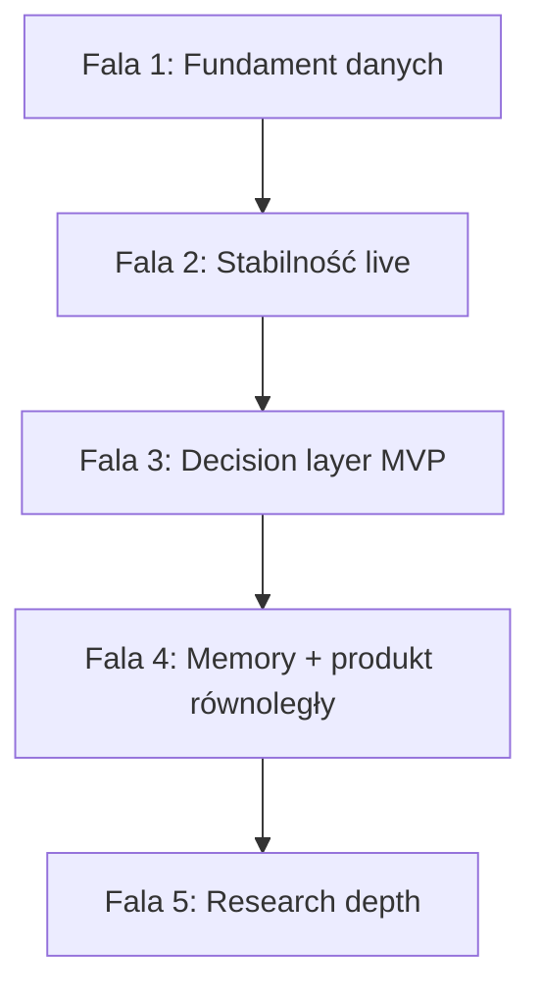

# Master plan implementacji — Bociarz LP

**Status:** plan strategiczny po analizie całego repozytorium (2026-05-20).  
**Wersja produktu:** `0.2.0-alpha.1` | **8 crate’ów Rust** + dashboard React/TS.

**keywords:** master-plan, implementation-roadmap, priorities, maturity, decision-layer, rolling-memory, session-capital, lineage, ingest, orchestrator, experiment-launcher, shadow-strategies

**Powiązane plany szczegółowe (nie duplikować — linkować):**

| Temat | Dokument |
| ----- | -------- |
| Orkiestrator LP (fazy 0–6) | [`IMPLEMENTATION_PLAN_DECISION_LAYER.md`](IMPLEMENTATION_PLAN_DECISION_LAYER.md) |
| Rolling memory | [`AGENT_ROLLING_MEMORY_PLAN.md`](AGENT_ROLLING_MEMORY_PLAN.md) |
| On-chain ingest / decode | [`TODO_ONCHAIN_NEXT_STEPS.md`](TODO_ONCHAIN_NEXT_STEPS.md) |
| Experiment launcher (A/B/C) | [`MULTI_STRATEGY_EXPERIMENT_LAUNCHER.md`](MULTI_STRATEGY_EXPERIMENT_LAUNCHER.md) |
| Shadow strategii na pozycji | [`ROADMAP.md`](ROADMAP.md) §40–75 |
| Wallet SESSION / executor | [`WALLET_SESSION_CAPITAL_EXECUTOR_PLAN.md`](WALLET_SESSION_CAPITAL_EXECUTOR_PLAN.md) |
| Close-all batch | [`POSITIONS_CLOSE_ALL_IMPLEMENTATION_PLAN.md`](POSITIONS_CLOSE_ALL_IMPLEMENTATION_PLAN.md) |
| Bollinger / last-candle | [`IMPLEMENTATION_PLAN_BOLLINGER_CANDLE_STRATEGIES.md`](IMPLEMENTATION_PLAN_BOLLINGER_CANDLE_STRATEGIES.md) |
| Architektura crate’ów | [`PROJECT_OVERVIEW.md`](PROJECT_OVERVIEW.md) |
| Rejestr bugów | [`BUGS.md`](BUGS.md) |

---

## 1. Executive summary

**Bociarz LP** to monorepo: symulacja + optymalizacja + **live bot Orca** + API/dashboard + pipeline danych on-chain (snapshots, swapy, decode). Produkt jest **operacyjny na Orca mainnet**, z silnym rdzeniem backtest/optimize i rosnącą warstwą operatorską (wallet GL, session capital, experiment launch, close-all).

**Największa luka strategiczna:** brak domkniętej pętli **„jakość danych → symulacja → ranking → raport → reviewed apply”** oraz **niespójność lifecycle** (reopen, lineage, valuation) — to blokuje zaufanie do metryk i do przyszłych shadow/experiment features.

**Rekomendacja:** **5 fal** — fundament danych → stabilność live → decision layer MVP → pamięć operacyjna + produkt równoległy → research depth. **Autonomiczne tx bez operatora** — poza tym planem (DECISION_LAYER faza 5).

---

## 2. Analiza stanu projektu (2026-05-20)

### 2.1 Mapa crate’ów i dojrzałość

| Crate | Rola | Dojrzałość |
| ----- | ---- | ---------- |
| `clmm-lp-domain` | Math, typy, `AgentDecision`, optimize schema | **Wysoka** |
| `clmm-lp-simulation` | Backtest engine, strategie symulowane | **Wysoka** |
| `clmm-lp-optimization` | Grid / objectives | **Wysoka** |
| `clmm-lp-protocols` | Orca executor **live**; Raydium/Meteora **read**; event parsers **stub** | **Średnia** (Orca), **Niska** (events) |
| `clmm-lp-execution` | Bot, `DecisionEngine`, rebalance close→open, session caps (flag) | **Wysoka** (rebalance), **Średnia** (increase_liquidity stub) |
| `clmm-lp-data` | Postgres, migrations 001–011, `wallet_session`, providers | **Wysoka** |
| `clmm-lp-api` | REST/WS, lineage/PnL, agent, close-all, GL | **Wysoka** |
| `clmm-lp-cli` | ~40 subcommandów, ingest, orchestrator gate/FULL | **Wysoka** |

### 2.2 Dojrzałość produktowa (subsystemy)

| Subsystem | Ocena | Uwaga |
| --------- | ----- | ----- |
| Live bot Orca | **9/10** | Pełny executor + StrategyExecutor + CLI `orca-bot-run` |
| Backtest / optimize | **8/10** | CLI + API `/backtests/full`; zależy od jakości ingest |
| Dashboard (web) | **7/10** | 22 trasy; experiment/close-all/session GL świeże; WebSocket bez subskrypcji |
| Stream lineage / PnL | **6/10** | Bogaty kod + testy; **aktywne bugi regresji** (BUG-20260413-05, BUG-20260512-03) |
| Wallet GL + SESSION | **7/10** | Journal + PG; session capital **flag-gated** (`CLMM_REOPEN_USE_SESSION_CAPITAL`) |
| Close-all | **6/10** | API działa; joby **in-memory** (restart = utrata batch) |
| Decision layer / orkiestrator | **4/10** | Gate + FULL MVP; brak rankingu/raportu/UI alert |
| Position Agent + LLM | **4/10** | Czat/supervisor live; LLM stateless; brak rolling memory |
| Multi-venue live LP | **3/10** | Raydium/Meteora: snapshot/decode, bez executora |
| Shadow strategies (ROADMAP) | **1/10** | Tylko dokumentacja |
| Event parsing / fee truth | **3/10** | Placeholdery w `protocols/events` |

### 2.3 Frontend — kluczowe obserwacje

- **Dojrzałe:** Positions, PositionDetail, Strategies, Backtests, WalletLedger, PositionCreate.
- **Świeże (git):** ExperimentLaunch (4 kroki, orchestracja **po stronie klienta**), SessionBalancesPanel, close-all na liście pozycji.
- **Luki:** brak historii batchy experiment (`localStorage` only); WebSocket connect bez invalidacji; Settings (API key/RPC) nie spięte z runtime; `cost_session_id` na close/collect w PositionDetail vs create flow.

### 2.4 Dokumentacja vs kod — spójność

| Obszar | Zgodność |
| ------ | -------- |
| Gate + `agent_decisions.jsonl` | **Zgodne** (orchestrator-gate) |
| IMPLEMENTATION_PLAN fazy 0–1 | **Zamknięte** |
| IMPLEMENTATION_PLAN fazy 2–4 | **Częściowe** (FULL API, brak raportu rankingowego) |
| AGENT_ROLLING_MEMORY M1–M3 | **Plan only** |
| TODO Phase A (ingest ops) | **Otwarte operacyjnie** — kod M1/M2/B4 gotowy |
| FUNCTIONAL_SPEC §8 decision layer | **Stub normatywny** |

### 2.5 Aktywne ryzyka (BUGS.md)

| Status | Liczba | Tematy |
| ------ | ------ | ------ |
| **open** | 4 | PositionCreate wallet race; rebalance bez reopen; brak UI testów; lineage baseline |
| **partially fixed** | 7 | Collect fees, quotes, performance vs history, Token-2022 |
| **regressed** | 2 | Reopen downsizing ~$10→~$4; false parent w stream-lineage |

**Klaster:** ~60% aktywnych problemów = **lifecycle pozycji + lineage + wallet/signing** — priorytet przed shadow/experiment E2E.

### 2.6 „Shadow” — trzy różne znaczenia (dług designowy)

1. **ROADMAP** — wiele strategii na jednym NFT (1 live + N shadow).
2. **DECISION_LAYER** — równoległe runy backtest/optimize (what-if off-chain).
3. **`event_bus_shadow_mode`** — test brokera API — **nie** LP shadow.

**Decyzja do podjęcia w Fali 4:** wspólny storage vs dwa byty — patrz [`DECISION_LAYER.md`](DECISION_LAYER.md) §10.

---

## 3. Zasady nadrzędne (nie negocjować)

1. **Źródło prawdy ekonomicznej:** mainnet + lokalne pliki; darmowy RPC z jawno dokumentowaną niepewnością decode.
2. **Decyzje tx:** deterministyczne reguły + symulacja + `AgentDecision` — **nie** LLM.
3. **NO-GO:** słabe dane → brak rankingu między parami i brak apply.
4. **Audyt:** każdy run orkiestratora = wejścia + wynik w JSONL (odtwarzalność).
5. **Scope PR:** małe slice’e; jeden plan szczegółowy per domena (link, nie duplikacja).

---

## 4. Plan implementacji — 5 fal

---

### Fala 1 — Fundament danych (operacyjny + lekki kod)

**Cel:** rankingi i optimize oparte na **wiarygodnych** snapshotach i decode.

**Czas:** 1–2 tygodnie (głównie ops; część równolegle z Falą 2).

| ID | Zadanie | Typ | Deliverable | Kryterium sukcesu |
| -- | ------- | --- | ----------- | ----------------- |
| F1.1 | Własny RPC + fallback | **Ops** | `SOLANA_RPC_URL`, `SOLANA_RPC_FALLBACK_URLS` | `getTransaction` OK dla sygnatur z okna 24h |
| F1.2 | Decode rebuild | **Ops** | TODO **A1** + **A2** | `% decode ok` ≥ próg (np. 65%) per curated pool |
| F1.3 | Ingest 24/7 | **Ops** | **A3–A5** `ops-ingest-loop` + NSSM/Task Scheduler | Brak alertów `data-health-check` >24h |
| F1.4 | Snapshot readiness guardian | **Ops + skrypt** | **A6** `snapshot-readiness` + `snapshot-backtest-prep` | Backtest z `--prepared-snapshot-window` bez parse raw JSONL |
| F1.5 | Health w CI/harmonogramie | **Ops** | `orchestrator-gate --fail-on-no-go` | Exit ≠ 0 przy NO-GO w schedulerze |

**Code pointers:** `crates/cli/src/swap_sync.rs`, `orchestrator_gate.rs`, [`TODO_ONCHAIN_NEXT_STEPS.md`](TODO_ONCHAIN_NEXT_STEPS.md).

**Blokuje:** wiarygodny ranking (Fala 3), porównania między parami.

---

### Fala 2 — Stabilność operacji live (trust)

**Cel:** bot i UI **nie gubią** pozycji, historii ani kapitału po rebalance.

**Czas:** 3–5 tygodni (2–4 PR-y backend + 1–2 frontend).

| ID | Zadanie | Priorytet | Pliki / obszar | Kryterium sukcesu |
| -- | ------- | --------- | -------------- | ----------------- |
| F2.1 | Reopen po rotacji | **P0** | `rebalance.rs`, pending-open, BUG-20260410-06 | Close rotation → open w tej samej sesji; brak wiszących „waiting for reopen” |
| F2.2 | Reopen downsizing | **P0** | BUG-20260512-03, session caps, `target_usd` | Notional po reopen ≥ target × (1−ε) lub jawny log `session_cap_*` |
| F2.3 | Stream lineage parent chain | **P0** | `position_stream_lineage.rs`, BUG-20260413-05 | Manual open ≠ false parent; bot rebalance łączy chain |
| F2.4 | Valuation vs lineage totals | **P1** | `position_stream_pnl`, valuation snapshots | Performance ≈ lineage baseline (regresja golden) |
| F2.5 | Session capital default path | **P1** | [`WALLET_SESSION_CAPITAL_EXECUTOR_PLAN.md`](WALLET_SESSION_CAPITAL_EXECUTOR_PLAN.md) | Reopen/open respektuje `SessionMintCaps` bez ręcznej flagi (po review) |
| F2.6 | PositionCreate wallet race | **P1** | `PositionCreate.tsx`, BUG-20260413-06 | Salda zawsze dla api-signer przed open |
| F2.7 | Session GL na close/collect (UI) | **P2** | `PositionDetail.tsx`, `cost_session_id` | Spójność z PositionCreate / experiment |
| F2.8 | Close-all persistence | **P2** | `position_close_all.rs` | Batch job w PG lub JSONL — przeżywa restart API |
| F2.9 | UI regression tests | **P2** | BUG-20260410-04 | Testy collect/swap message passthrough |

**Blokuje:** experiment launcher E2E, shadow strategies, zaufanie operatora.

---

### Fala 3 — Decision layer MVP (analiza bez autonomii tx)

**Cel:** powtarzalna pętla **gate → symulacje → ranking → log → alert → reviewed apply**.

**Czas:** 2–4 tygodnie (rozszerza [`IMPLEMENTATION_PLAN_DECISION_LAYER.md`](IMPLEMENTATION_PLAN_DECISION_LAYER.md) fazy 2–4).

| ID | Zadanie | Stan dziś | Deliverable |
| -- | ------- | --------- | ----------- |
| F3.1 | Gate harmonogram | **Done** | — |
| F3.2 | FULL backtests API | **Partial** | — |
| F3.3 | **Raport rankingowy** | **Brak** | Jeden JSON/MD: N wariantów + winner vs **obecny** `width_pct` strategii |
| F3.4 | Real vs sim composite | **Brak** | Tabela optimize + wiersz `stream-pnl` / supervisor dla pozycji |
| F3.5 | Alert / UI | **Brak** | Dashboard lub `/data-quality`: ostatni gate, winner Δ, link do raportu |
| F3.6 | Runbook apply | **Częściowy** | Dok + UI: `approved: true/false`, `optimization_busy`, polityka |
| F3.7 | Lokalny multi-variant bez FULL | **Opcjonalnie** | CLI pętla `backtest-optimize` → `data/reports/orchestrator-*.json` |

**Kryterium sukcesu Fali 3:** operator co 24h widzi **jeden** audytowalny raport; przy NO-GO — brak rankingu; apply tylko świadomie.

**Nie w scope:** autonomiczne open/close (faza 5 DECISION_LAYER).

---

### Fala 4 — Pamięć operacyjna + wybór produktu równoległego

**Cel:** ciągłość kontekstu bez sesji LLM + **jeden** z dwóch produktów równoległych.

**Czas:** 3–6 tygodni.

#### 4A — Rolling memory ([`AGENT_ROLLING_MEMORY_PLAN.md`](AGENT_ROLLING_MEMORY_PLAN.md))

| ID | Zadanie | Deliverable |
| -- | ------- | ----------- |
| F4A.1 | M1 global + position JSON | `data/agent/memory/global.json`, `position/{addr}.json`, `events.jsonl` |
| F4A.2 | Hook gate/FULL → global | Po append `agent_decisions.jsonl` |
| F4A.3 | Hook worker scan → position | `run_periodic_scan_tick` |
| F4A.4 | M2 LLM pack | Rozszerzenie `AgentLlmContext` (domyślnie LLM off) |
| F4A.5 | UI memory panel | Read-only na PositionDetail (opcjonalnie) |

#### 4B — Wybór **jednego** produktu (decyzja produktowa)

| Opcja | Opis | Wymaga |
| ----- | ---- | ------ |
| **B1: Experiment launcher E2E** | Batch open wielu ramion; server-side orchestrator + retry | F2 stabilne, session GL |
| **B2: ROADMAP shadow (1 live + N shadow)** | Counterfactual na jednym NFT | F2 lineage, model storage (§10 DECISION_LAYER) |

**Rekomendacja:** jeśli priorytet = **porównanie strategii na żywo** → **B1** (experiment launcher ma już UI). Jeśli priorytet = **jedna pozycja, wiele polityk** → **B2**. **Nie robić obu pełnych ścieżek równolegle** bez wspólnego modelu assignment.

| ID | Zadanie (B1 — experiment) | Deliverable |
| -- | ------------------------- | ----------- |
| F4B1.1 | Backend batch registry | `POST /experiments/launch` lub job JSONL |
| F4B1.2 | Historia batchy w UI | Strona `/experiments` z listą (nie tylko localStorage) |
| F4B1.3 | Nav + i18n cleanup | Sidebar, usunięcie PR-4 placeholder |

| ID | Zadanie (B2 — shadow) | Deliverable |
| -- | --------------------- | ----------- |
| F4B2.1 | Model assignment live/shadow | DB + API |
| F4B2.2 | Shadow evaluator tick | DecisionEngine dry-run per shadow strategy |
| F4B2.3 | UI porównanie metryk | PositionDetail: live vs N shadow |

---

### Fala 5 — Research depth (równoległa, nie blokuje ops)

| ID | Temat | Dokument |
| -- | ----- | -------- |
| F5.1 | Fee truth / event parsing | `protocols/events`, TODO D/E |
| F5.2 | Bollinger + last-candle (jeśli nie w prod) | [`IMPLEMENTATION_PLAN_BOLLINGER_CANDLE_STRATEGIES.md`](IMPLEMENTATION_PLAN_BOLLINGER_CANDLE_STRATEGIES.md) |
| F5.3 | Multi-pool ranking orkiestratora | DECISION_LAYER faza 3 |
| F5.4 | Meteora/Raydium live executor | długi horyzont |
| F5.5 | Chart agent layer | [`TODO_CHART_AGENT_LAYER.md`](TODO_CHART_AGENT_LAYER.md) — osobny profil |
| F5.6 | WebSocket live invalidation | `web/` Layout + React Query |
| F5.7 | `increase_liquidity` (bez close→open) | `rebalance.rs` stub |

---

## 5. Kolejność PR (najbliższe 90 dni)

Sugerowana kolejność merge (można równoleglić F1 ops z F2 kod):

| # | PR / slice | Fala | Szacunek |
| - | ---------- | ---- | -------- |
| 1 | F2.1 + F2.3 — reopen + lineage parent | 2 | 1–2 tyg. |
| 2 | F2.2 — reopen downsizing + test regresji | 2 | 1 tyg. |
| 3 | F1 ops checklist (dokument runbook ops) | 1 | równolegle |
| 4 | F3.3 — raport rankingowy post-FULL | 3 | 1 tyg. |
| 5 | F2.6 + F2.7 — PositionCreate race + session GL detail | 2 | 3–5 dni |
| 6 | F3.4 + F3.5 — composite report + UI alert | 3 | 1–2 tyg. |
| 7 | F4A.1 — rolling memory M1 | 4 | 3–5 dni |
| 8 | F2.8 — close-all job persistence | 2 | 3–5 dni |
| 9 | F4B — experiment **lub** shadow (decyzja) | 4 | 2–4 tyg. |
| 10 | F4A.4 — LLM pack (opcjonalnie) | 4 | 3–5 dni |

---

## 6. Metryki sukcesu (cały plan)

| Metryka | Target |
| ------- | ------ |
| Decode OK % (curated) | ≥ 65% utrzymane 7 dni |
| Gate outcome | `ok` > 90% runów tygodniowo (przy własnym RPC) |
| Reopen success po rotation | > 95% sesji bez manual recovery |
| Lineage chain integrity | 0 regresji BUG-20260413-05 w testach golden |
| Orkiestrator raport | ≥ 1 raport/dobę z winner vs current |
| Experiment/shadow (F4) | 1 wybrany produkt E2E demo na 3+ ramionach |
| Rolling memory | Pliki memory aktualne < 1h po gate/scan |

---

## 7. Poza zakresem tego planu

- Autonomiczne tx bez operatora (DECISION_LAYER faza 5).
- RAG / wektorowa pamięć LLM.
- Fine-tuning modeli.
- Płatne API jako domyślna ścieżka (Birdeye/Dune default).
- Pełny multi-venue live LP poza Orca.

---

## 8. Mapowanie istniejącej pracy (git) → fale

| Obszar w bieżących zmianach | Fala |
| --------------------------- | ---- |
| Wallet session GL, session-balances | F2 (F2.5, F2.7) |
| Close-all API + UI | F2 (F2.8 persistence) |
| Experiment launch UI | F4B1 |
| Position stream lineage fixes | F2 (F2.3, F2.4) |
| AGENT_ROLLING_MEMORY plan | F4A |

---

## 9. Utrzymanie dokumentu

- Przy zamknięciu fazy — zaktualizuj tabelę w §2.2 i checkbox w §4.
- Przy nowym bugu P0 — dopisz do F2 backlog; nie przesuwaj F3 przed domknięciem F2.1–F2.3.
- Szczegóły implementacji — w dokumentach z § powiązane; ten plik = **tylko kolejność i priorytety**.

---

## Document status

| Field | Value |
| ----- | ----- |
| Role | **Master** implementation roadmap after full-repo analysis |
| Created | 2026-05-20 |
| Next review | Po zamknięciu Fali 2 lub zmianie priorytetu B1 vs B2 |
