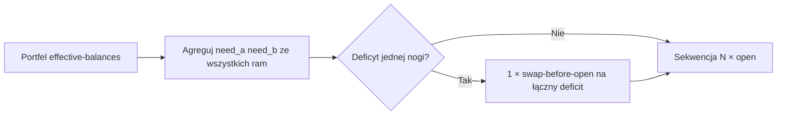
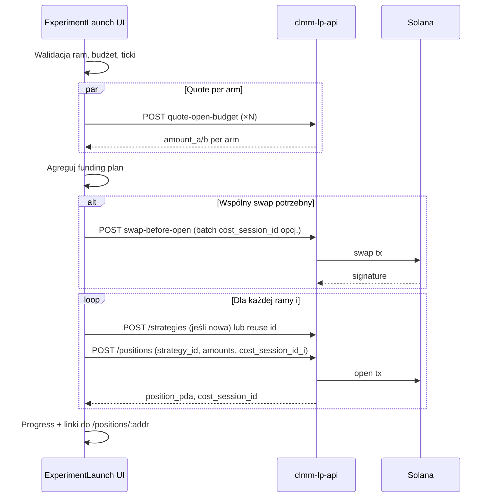

# Multi-Strategy Experiment Launcher — porównanie strategii na żywo

**Status:** accepted (spec + plan fazy 1; **implementacja po PR-ach poniżej**)  
**Data:** 2026-05-20  
**Nazwa robocza UI:** *Strategy Battle* / *Experiment Launch*  
**Proponowana trasa:** `/experiments/new`

**Powiązane:** [`FUNCTIONAL_SPECIFICATION.md`](FUNCTIONAL_SPECIFICATION.md) §2 (portfel, open), [`UI_REQUIREMENTS_PHASE1.md`](UI_REQUIREMENTS_PHASE1.md), [`BACKTEST_OPTIMIZE_STRATEGIES.md`](BACKTEST_OPTIMIZE_STRATEGIES.md), [`WALLET_GL.md`](WALLET_GL.md) §2.2, [`WALLET_SESSION_CAPITAL_EXECUTOR_PLAN.md`](WALLET_SESSION_CAPITAL_EXECUTOR_PLAN.md), [`ROADMAP.md`](ROADMAP.md), [`DECISION_LAYER.md`](DECISION_LAYER.md)

**keywords:** experiment-launcher, multi-strategy, strategy-battle, live-comparison, capital-allocation, shared-swap, batch-open, quote-open-budget, swap-before-open, GRID_PRESETS, cost_session_id, arms, A/B/C

---

## 1. Streszczenie

Operator potrzebuje **wygodnego interfejsu do równoległego startu wielu pozycji LP z różnymi strategiami** — na tej samej puli (typowy case: strategia A vs B vs C), z:

- presetami strategii przy dodawaniu ram (z możliwością edycji),
- wspólnym budżetem kapitału z portfela (np. 30 USD) i automatycznym podziałem na ramy,
- opcjonalnym **wspólnym swapem** finansującym wszystkie otwarcia naraz,
- przyciskiem **„Odpal wszystkie”**, który otwiera pozycje z przypisanymi strategiami i wyliczonymi kwotami.

Dziś repo ma **porównanie strategii tylko w symulacji** (`/backtests`, `GRID_PRESETS`) oraz **ręczne otwarcie jednej pozycji** (`/positions/new`). Ten dokument definiuje most między backtestem a live launch.

| Aspekt | Dziś (2026-05-20) | Docelowo (ten feature) |
| ------ | ----------------- | ---------------------- |
| Porównanie strategii | Historyczny backtest (`POST /backtests/full`) | **Live** — N pozycji z różnymi executorami |
| Otwarcie pozycji | 1× ręcznie (`PositionCreate.tsx`) | N× z jednego wizarda |
| Presety | `GRID_PRESETS` tylko w Backtests | Reuse + edycja inline w launcherze |
| Budżet USD | Per pozycja (`quote-open-budget`) | Wspólny budżet + podział na ramy |
| Swap przed open | 1 swap in-pool Orca na 1 pozycję | **Agregowany** swap na łączny deficit |
| Sesja księgowa | `cost_session_id` per open | Osobny `cost_session_id` per rama + opcj. batch id |
| Metryki porównawcze | Ranking backtestu | Istniejące: stream-pnl, chain-history, backtest-from-open per PDA |

---

## 2. Cele produktowe

### 2.1 Główne

1. **Szybkie A/B/C na żywo** — bez N-krotnego przechodzenia przez `/positions/new`.
2. **Spójny kapitał startowy** — każda rama dostaje z góry ustalony udział (równy lub ręczny), w USD.
3. **Minimalna liczba swapów** — jeden wspólny swap (gdy możliwe) zamiast N osobnych.
4. **Presety + edycja** — start z katalogu / `GRID_PRESETS`, potem doprecyzowanie parametrów.
5. **Automatyczny start strategii** — po open link PDA + auto-start executora (zachowanie jak dziś przy `strategy_id` w `POST /positions`).

### 2.2 Poza zakresem v1

- Shadow strategies na jednej pozycji (patrz [`ROADMAP.md`](ROADMAP.md)) — tu **osobna pozycja per strategia**.
- Twarda izolacja kapitału on-chain (policy **5b** w [`WALLET_SESSION_CAPITAL_EXECUTOR_PLAN.md`](WALLET_SESSION_CAPITAL_EXECUTOR_PLAN.md)).
- Automatyczny wybór „zwycięzcy” i zamknięcie przegranych (to warstwa decyzyjna — [`DECISION_LAYER.md`](DECISION_LAYER.md)).
- Cross-venue (Orca + Meteora w jednym batchu) — faza 3+.

---

## 3. Persona i scenariusze

### 3.1 Operator porównujący strategie na SOL/USDC

1. Wybiera pulę Orca SOL/USDC.
2. Dodaje 3 ramy: `threshold 5%`, `bollinger k=2.0`, `last_candle 30s` (z presetów).
3. Ustawia wspólny budżet **30 USD** → system proponuje **10 USD / ramę**.
4. Klika **„Plan funding”** → widzi łączne wymagane SOL + USDC i jeden proponowany swap.
5. Klika **„Odpal wszystkie”** → 1 swap (jeśli potrzeba) + 3 open tx.
6. Na liście pozycji widzi 3 nowe wpisy z linkami do strategii; porównuje PnL w czasie.

### 3.2 Import z istniejących pozycji

Operator zaznacza **„Import parametrów z pozycji”** i wybiera 2–5 aktywnych pozycji — system kopiuje typ strategii i parametry z `GET /positions/:addr/experiment-config` (już używane przez backtest-from-open).

### 3.3 Katalog strategii z backtestów

**„Dodaj wszystkie z katalogu”** — checkbox dodaje ramy dla każdego `strategy_type` z `GET /backtests/strategy-catalog` z domyślnymi parametrami z `GRID_PRESETS` (Balanced).

---

## 4. Model UI (wizard)

Proponowany układ ekranu `/experiments/new`:

```
┌─────────────────────────────────────────────────────────────────────┐
│  Multi-Strategy Experiment                                          │
├─────────────────────────────────────────────────────────────────────┤
│  Krok 1 — Pula                                                      │
│  Pool: [ Orca SOL/USDC ▼ ]  [ manual address ]                      │
├─────────────────────────────────────────────────────────────────────┤
│  Krok 2 — Ramy strategii (arms)                    [ + Dodaj ramę ] │
│  ┌───────────────────────────────────────────────────────────────┐  │
│  │ ☑ Arm 1  preset [Conservative ▼]  [Edytuj parametry]       │  │
│  │ ☑ Arm 2  preset [Balanced ▼]        [Edytuj parametry]       │  │
│  │ ☑ Arm 3  istniejąca strategia [uuid… ▼]                      │  │
│  └───────────────────────────────────────────────────────────────┘  │
│  [Zaznacz wszystkie z katalogu]  [Import z pozycji…]                │
├─────────────────────────────────────────────────────────────────────┤
│  Krok 3 — Kapitał                                                   │
│  Wspólny budżet: [ 30.00 ] USD     Tryb: [ Równo ▼ | % | USD/rama ] │
│  [Swap →]  (wspólny, agregowany)                                    │
│  ─────────────────────────────────────────────────────────────────  │
│  Arm 1: 10.00 USD  need: 0.05 SOL + 5.2 USDC   [Swap →]  ✓         │
│  Arm 2: 10.00 USD  need: …                     [Swap →]  ⚠         │
│  Arm 3: 10.00 USD  need: …                     [Swap →]  ✓         │
├─────────────────────────────────────────────────────────────────────┤
│  Krok 4 — Podgląd i launch                                          │
│  [ Plan funding ]  [ Dry-run ]  [ Odpal wszystkie ]                 │
│  Progress: swap ✓ | arm1 open ✓ | arm2 open … | arm3 pending        │
└─────────────────────────────────────────────────────────────────────┘
```

### 4.1 Presety strategii

| Źródło presetu | Opis |
| -------------- | ---- |
| `GRID_PRESETS` | Ultra-safe, Conservative, Balanced, Aggressive, Scalper — jak w `Backtests.tsx` |
| Istniejąca strategia | `GET /strategies` — reuse `name`, `strategy_type`, `parameters` |
| Import z pozycji | `GET /positions/:addr/experiment-config` |
| Katalog backtestów | `GET /backtests/strategy-catalog` + domyślne siatki |

Edycja inline używa wspólnego modelu formularza (`web/src/lib/strategyFormShared.ts`).

### 4.2 Ticki i range per rama

Każda rama może mieć **inne ticki** (Bollinger vs static vs threshold z `range_width_pct`):

- Bollinger: ticks z historii snapshotów (jak `PositionCreate`).
- Inne z `range_width_pct`: ticks wokół live ceny puli.
- Static manual: operator podaje tick lower/upper.

Dla każdej ramy osobno: `POST /pools/:address/quote-open-budget` z `{ tick_lower, tick_upper, target_usd }`.

---

## 5. Alokacja kapitału

### 5.1 Wspólny budżet

| Pole | Semantyka |
| ---- | --------- |
| `total_budget_usd` | Kwota przeznaczona na **cały eksperyment** (np. 30 USD) |
| `allocation_mode` | `equal` \| `percent` \| `fixed_usd_per_arm` |
| `arm_budget_usd[i]` | Wyliczone lub ręczne; suma ≤ `total_budget_usd` (walidacja UI) |

**Równy podział:** `arm_budget_usd = total_budget_usd / N` (N = liczba zaznaczonych ram).

### 5.2 Od USD do tokenów

Dla ramy `i`:

1. `quote-open-budget(pool, ticks_i, target_usd = arm_budget_usd[i])` → `(amount_a_i, amount_b_i, token_max_a_i, token_max_b_i)`.
2. Preflight: porównanie z `GET /wallets/effective-balances` (jak dziś w `PositionCreate`).
3. Status ramy: `funded` \| `short_a` \| `short_b` \| `short_both` \| `short_operational_sol`.

### 5.3 Swap per pole vs wspólny swap

| Akcja | Kiedy | Mechanizm |
| ----- | ----- | --------- |
| **Swap → przy wspólnym budżecie** | Operator chce dofinansować całość jednym ruchem | Algorytm agregacji (§6) |
| **Swap → przy ramie** | Pojedynczy deficit po podziale | Ten sam plan co `PositionCreate` (`swap-before-open`) |
| **Odpal wszystkie** | Launch | Najpierw opcjonalny wspólny swap, potem sekwencja open |

**Uwaga:** Preflight open flow dziś używa **globalnego** portfela (`effective-balances`), nie SESSION caps — spójne z [`FUNCTIONAL_SPECIFICATION.md`](FUNCTIONAL_SPECIFICATION.md). Każda rama dostaje **własny** `cost_session_id` dla księgowości po fakcie.

---

## 6. Wspólny swap — algorytm i ograniczenia

To **najważniejszy element techniczny** feature’u. Celem jest **minimalna liczba transakcji** i **przewidywalny czas** przy wielu ramach.

### 6.1 Stan obecny w repo

- `POST /positions/swap-before-open` — **ExactIn w puli Orca Whirlpool** (nie Jupiter).
- Jeden kierunek: token A → B lub B → A (lub operational SOL via WSOL w parze).
- Implementacja: `position_service::swap_before_open_exact_in` → `execute_swap_exact_in`.

### 6.2 Scenariusz A — ta sama pula (MVP, priorytet 1)

Wszystkie ramy dzielą `(token_mint_a, token_mint_b)`.



**Algorytm agregacji (pseudokod):**

```
for each arm i:
  (need_a_i, need_b_i) = quote_open_budget(arm_i)

total_need_a = sum(need_a_i)
total_need_b = sum(need_b_i)

have_a, have_b = effective_balances(pool mints)

deficit_a = max(0, total_need_a - have_a)
deficit_b = max(0, total_need_b - have_b)

if deficit_a > 0 and deficit_b > 0:
  → błąd: brakuje obu nóg — operator musi dołożyć kapitał lub zmniejszyć budżet
elif deficit_b > 0:
  → swap A→B, amount_in = estimate(deficit_b)  // jak PositionCreate
elif deficit_a > 0:
  → swap B→A, amount_in = estimate(deficit_a)
else:
  → brak swapu

// Po swapie: refresh balances, weryfikacja per rama przed open
```

**Zalety:** 1 swap + N open; reuse istniejącego API; szybkie (~2–4 tx łącznie dla 3 ram).

**Ograniczenia:** Wszystkie ramy muszą być w **tej samej puli**; swap tylko między nogami puli.

### 6.3 Scenariusz B — różne pule, ta sama para tokenów

Np. dwa adresy Whirlpool SOL/USDC z różnymi fee tier — **ta sama para mintów**.

- Agregacja jak w §6.2 po `(mint_a, mint_b)`.
- **Jeden swap** w wybranej puli referencyjnej (domyślnie: pula z kroku 1).
- Open per rama w **własnej** puli.

Ryzyko: slippage / cena między pulami — bufor +5% jak w `PositionCreate`.

### 6.4 Scenariusz C — różne pary tokenów (faza 3)

Grupowanie: `Map<(mint_a, mint_b), arms[]>`.

- Per grupa: algorytm §6.2 → do **G** swapów (G = liczba unikalnych par).
- Funding z jednego tokena (np. tylko USDC): wymaga **Jupiter** (route USDC → SOL, USDC → cbBTC, …).

**Jupiter (research 2026-05):**

| API | Możliwość |
| --- | --------- |
| `/order` + `/execute` | Pojedynczy swap, meta-aggregator (Metis, JupiterZ, …) |
| `/build` | Surowe instrukcje — **wiele swapów w jednej transakcji** możliwe, limit ~1.4M compute units |
| Portfolio API | Metadane platform; **brak** dedykowanego „rebalance do N targetów” |

**Nie ma** gotowego endpointu „portfolio rebalance”. Plan:

1. Oblicz per mint: `target_mint[m] = sum needs`, `current[m] = balance`.
2. Netting: minty z nadwyżką vs deficyt — minimalna liczba tras.
3. Dla ≤3 tras w jednej tx: Jupiter `/build` + compose (faza 3).
4. W przeciwnym razie: sekwencja Jupiter swapów (równoległe quote, sekwencyjne execute).

### 6.5 Wydajność — wymagania niefunkcjonalne

| Wymaganie | Cel | Sposób |
| --------- | --- | ------ |
| Czas planowania | < 3 s dla 5 ram | Równoległe `quote-open-budget` (`Promise.all`) |
| Liczba swapów (ta sama pula) | **1** | Agregacja §6.2 |
| Liczba swapów (cross-pool) | ≤ liczba unikalnych par tokenów | Grupowanie |
| Open tx | N sekwencyjnych | Unikaj równoległych tx z jednego signera (nonce/blockhash) |
| Retry | Per krok | Swap fail → stop; open i fail → kontynuuj pozostałe + raport |

---

## 7. Flow launch („Odpal wszystkie”)



### 7.1 Identyfikatory sesji

| ID | Zastosowanie |
| -- | ------------ |
| `batch_id` (opcjonalny, UI/localStorage) | Korelacja całego eksperymentu w UI |
| `cost_session_id` per rama | Osobny UUID; journal + SESSION GL per pozycja |
| `strategy_id` per rama | Link executor ↔ PDA |

### 7.2 Tworzenie strategii

Tryby:

1. **Nowa strategia per rama** — `POST /strategies` przed open (nazwa: `{experiment}-{arm}-{preset}`).
2. **Reuse istniejącej** — dropdown strategii; open z `strategy_id`.
3. **Hybryda** — klon parametrów z istniejącej bez mutacji oryginału.

Po udanym open API już dziś: link PDA + `ensure_strategy_running_after_position_link`.

### 7.3 Obsługa błędów częściowych

| Etap | Sukces | Failure |
| ---- | ------ | ------- |
| Wspólny swap | Idź do open | **Stop** — salda niepewne; pokaż signature jeśli tx poszła |
| Open rama i | Zapisz PDA; następna rama | Log błędu; **kontynuuj** pozostałe (operator decyduje o retry) |
| Strategia start | Info w UI | Pozycja otwarta bez executora — link do ręcznego start |

UI powinno pokazać **tabelę wyników** z kolumnami: rama, status, `position_pda`, `cost_session_id`, błąd.

---

## 8. Mapowanie na istniejące API

### 8.1 Endpointy używane bez zmian (faza 1)

| Endpoint | Rola w launcherze |
| -------- | ----------------- |
| `GET /strategies` | Lista strategii do reuse |
| `POST /strategies` | Utworzenie strategii per rama |
| `GET /pools/:addr`, `GET /pools/:addr/state` | Metadane puli, tick current |
| `POST /pools/:addr/quote-open-budget` | Sizing per rama |
| `GET /wallets/effective-balances` | Preflight funding |
| `GET /analytics/mint-prices-usd` (przez web) | Estymacja swap |
| `POST /positions/swap-before-open` | Wspólny lub per-rama swap |
| `POST /positions` | Open z `strategy_id`, `cost_session_id` |
| `GET /positions/:addr/experiment-config` | Import z pozycji |
| `GET /backtests/strategy-catalog` | Katalog typów |

### 8.2 Proponowane endpointy (faza 2+, opcjonalne)

#### `POST /api/v1/experiments/plan-funding`

Request:

```json
{
  "pool_address": "Czfq3xZZ…",
  "owner": "optional wallet pubkey",
  "arms": [
    {
      "arm_id": "arm-1",
      "tick_lower": -887220,
      "tick_upper": 887220,
      "target_usd": 10.0
    }
  ]
}
```

Response:

```json
{
  "arms": [
    {
      "arm_id": "arm-1",
      "amount_a": 12345,
      "amount_b": 67890,
      "estimated_value_usd": 9.98,
      "funding_status": "funded"
    }
  ],
  "aggregate": {
    "total_need_a": 37000,
    "total_need_b": 20000000,
    "deficit_a_ui": 0,
    "deficit_b_ui": 1.2
  },
  "recommended_swap": {
    "pool_address": "Czfq3xZZ…",
    "specified_mint": "So111…",
    "amount_in": 50000000,
    "label": "SOL → USDC (aggregated)"
  }
}
```

#### `POST /api/v1/experiments/launch`

Orchestracja server-side (retry, logging, opcjonalny dry-run):

```json
{
  "pool_address": "…",
  "total_budget_usd": 30,
  "allocation_mode": "equal",
  "shared_swap": true,
  "slippage_tolerance_bps": 50,
  "arms": [
    {
      "strategy": {
        "name": "exp-threshold-5",
        "strategy_type": "threshold",
        "parameters": { "range_width_pct": 5, "rebalance_interval_hours": 24 }
      },
      "tick_lower": -100,
      "tick_upper": 100,
      "budget_usd": 10
    }
  ]
}
```

Response:

```json
{
  "batch_id": "uuid",
  "shared_swap_signature": "…",
  "arms": [
    {
      "arm_id": "…",
      "strategy_id": "…",
      "cost_session_id": "…",
      "position_pda": "…",
      "status": "opened",
      "error": null
    }
  ]
}
```

**Faza 1 może obejść te endpointy** — cała orchestracja w frontendzie.

---

## 9. Porównanie wyników po launchu

Launcher **nie musi** duplikować backtest UI. Po otwarciu operator używa istniejących widoków:

| Widok | Metryka |
| ----- | ------- |
| `GET /positions` | Lista z PnL / value_usd |
| `GET /positions/:addr/stream-pnl` | Stream performance |
| `GET /positions/:addr/chain-history` | Lineage, fees, baseline |
| `POST /backtests/from-open-position` | Backtest od momentu open |
| `SessionBalancesPanel` | Inwentarz per `cost_session_id` |
| `WalletLedger` filtr sesji | Journal swap + open |

**Roadmap UI:** strona `/experiments/:batch_id` z tabelą ram i sparkline PnL (faza 2).

---

## 10. Plan implementacji (fazy)

### 10.0 Decyzje zaakceptowane (start fazy 1)

| # | Pytanie | Decyzja |
| - | ------- | ------- |
| D1 | Trasa UI | **`/experiments/new`** (osobna strona; nie `/positions/batch-new`) |
| D2 | Zakres fazy 1 | **Tylko ta sama pula** dla wszystkich ram |
| D3 | Strategie | **Oba tryby w UI:** nowa strategia per rama + reuse z `GET /strategies` |
| D4 | Backend batch | **Pomijamy w fazie 1** — orchestracja w frontendzie |
| D5 | Min. budżet per rama | **Soft floor 5 USD** w walidacji UI; ostrzeżenie (nie twardy blok) — patrz [`MAINNET_MIN_POSITION_SIZING.md`](MAINNET_MIN_POSITION_SIZING.md) |
| D6 | Max ram (v1) | **8** — powyżej: ostrzeżenie o czasie launch i RPC |
| D7 | `batch_id` | UUID generowany w UI; zapis w `localStorage` + opcj. query po launch |

### 10.1 Out of scope v1 (nie rozszerzać PR-ów fazy 1)

Cross-pool, Jupiter multi-route, backend `POST /experiments/*`, persist batch w PG, strona `/experiments/:batch_id`, SESSION-cap preflight, auto-zamykanie przegranych ram.

---

### Faza 1 — MVP (frontend-only, ta sama pula)

#### PR-1 — Routing + szkielet wizarda

| Pole | Wartość |
| ---- | ------- |
| **Zakres** | Trasa, layout kroków, pusty stan, wybór puli |
| **Pliki** | `web/src/pages/ExperimentLaunch.tsx`, `web/src/App.tsx`, opcj. `web/src/components/Layout.tsx` (nav) |
| **Zależności** | Brak |

**Zadania:**

| # | Task | Done when |
| - | ---- | --------- |
| 1.1 | Route `/experiments/new` | Strona renderuje 4 kroki (pula → ramy → kapitał → launch) |
| 1.2 | Wybór puli | Reuse wzorca z `PositionCreate.tsx` (dropdown + manual address) |
| 1.3 | Stan ram (pusta lista) | Można dodać/usunąć ramę; min 1, max 8 |
| 1.4 | Nawigacja | Link „Nowy eksperyment” z `Positions.tsx` i/lub `Strategies.tsx` |

**Kryterium done PR-1:** Wejście na `/experiments/new`, wybór puli SOL/USDC, dodanie 3 pustych ram — bez błędów TS; `npx tsc --noEmit` w `web/` OK.

---

#### PR-2 — Presety ram + edycja parametrów

| Pole | Wartość |
| ---- | ------- |
| **Zakres** | Model ramy, presety, inline edit strategii, ticki |
| **Pliki** | `web/src/lib/experimentArm.ts`, `web/src/components/ExperimentArmEditor.tsx`, reuse `strategyFormShared.ts`, `GRID_PRESETS` (wyciągnięcie do shared lub import) |
| **Zależności** | PR-1 |

**Zadania:**

| # | Task | Done when |
| - | ---- | --------- |
| 2.1 | Model `ExperimentArm` | `id`, `enabled`, `preset`, `strategyType`, `parameters`, `strategyId?`, `tickLower/Upper`, `budgetUsd?` |
| 2.2 | Presety | Przyciski Ultra-safe … Scalper (jak Backtests) + „Reuse strategii” z dropdown |
| 2.3 | Edycja parametrów | Modal/panel z polami per `StrategyType` |
| 2.4 | Ticki per rama | Bollinger / `range_width_pct` / manual — reuse logiki z `PositionCreate` |
| 2.5 | Import (opcj.) | „Import z pozycji” → `GET /positions/:addr/experiment-config` |

**Kryterium done PR-2:** 3 ramy z różnymi presetami i tickami; podgląd parametrów przed krokiem kapitału.

---

#### PR-3 — Kapitał + wspólny swap (plan funding)

| Pole | Wartość |
| ---- | ------- |
| **Zakres** | Podział USD, quote per rama, agregacja, plan swapu |
| **Pliki** | `web/src/lib/experimentCapital.ts`, `web/src/lib/experimentFundingPlan.ts`, fragmenty wyciągnięte z `PositionCreate.tsx` (estymatory swap) |
| **Zależności** | PR-2 |

**Zadania:**

| # | Task | Done when |
| - | ---- | --------- |
| 3.1 | Wspólny budżet | Pole USD + tryb: equal / percent / fixed per arm |
| 3.2 | Quote równoległy | `Promise.all(quoteOpenBudget)` per enabled arm |
| 3.3 | Agregacja §6.2 | `aggregateTokenNeeds` + `planSharedSwap` |
| 3.4 | UI funding | Status per rama (funded / short); przyciski Swap → (wspólny + per rama) |
| 3.5 | Walidacja | Suma arm budgets ≤ total; warn jeśli arm < 5 USD |
| 3.6 | Unit tests | `splitBudgetEqual`, `aggregateTokenNeeds`, `planSharedSwap` — edge cases |

**Kryterium done PR-3:** Dla 3 ram × 10 USD na puli SOL/USDC UI pokazuje łączne need A/B, jeden `recommended_swap` gdy jedna noga w deficycie; bez wysyłania tx.

---

#### PR-4 — Launch orchestrator + wyniki

| Pole | Wartość |
| ---- | ------- |
| **Zakres** | Odpal wszystkie, progress, partial failure, i18n |
| **Pliki** | `web/src/lib/experimentLaunch.ts`, `ExperimentLaunch.tsx`, `web/src/lib/i18n.tsx` |
| **Zależności** | PR-3 |

**Zadania:**

| # | Task | Done when |
| - | ---- | --------- |
| 4.1 | Sekwencja launch | shared swap (opt.) → `POST /strategies` (jeśli nowa) → `POST /positions` × N |
| 4.2 | `cost_session_id` | Osobny UUID per rama; opcj. wspólny prefix w `batch_id` |
| 4.3 | Progress UI | Tabela: rama, status, PDA, session_id, error |
| 4.4 | Partial failure | Open i fail nie blokuje i+1; swap fail = stop |
| 4.5 | Post-launch | Linki do `/positions/:addr`; zapis `batch_id` w localStorage |
| 4.6 | i18n PL/EN | Klucze dla kroków wizarda i komunikatów błędów |
| 4.7 | Odświeżenie sald | Po swapie: invalidate `effective-balances` przed open |

**Kryterium done PR-4 (E2E devnet / limited live):**

1. 3 ramy, **30 USD** total, equal split (**10 USD** / rama).
2. Portfel z dominującą jedną nogą → **1 wspólny swap** → **3 open** tx.
3. Każda rama: `position_pda`, `strategy_id`, executor running (jak single open).
4. Partial failure: symulacja błędu ticków na 1 ramie → 2 success + 1 error w tabeli.

---

#### Podsumowanie fazy 1

| PR | Tytuł | Szacunek |
| -- | ----- | -------- |
| PR-1 | Routing + szkielet | 0.5 sesji |
| PR-2 | Presety + edycja | 1 sesja |
| PR-3 | Kapitał + swap plan | 1 sesja |
| PR-4 | Launch + i18n + E2E | 1 sesja |

**Po merge PR-1…PR-4:** wpis w [`ENGINEERING_NOTES.md`](ENGINEERING_NOTES.md) (`keywords: experiment-launcher, …`).

---

### Faza 2 — Backend plan + batch launch

| # | Zadanie | Trigger (kiedy zacząć) |
| - | ------- | ---------------------- |
| 2.1 | `POST /experiments/plan-funding` | Gdy frontend duplikuje logikę §6.2 w 2+ miejscach |
| 2.2 | `POST /experiments/launch` | Gdy potrzebny server-side retry / audit trail |
| 2.3 | OpenAPI + testy handlerów | Razem z 2.1–2.2 |
| 2.4 | Persist `experiment_batches` (opcj. PG) | Gdy localStorage batch_id niewystarczający |

**Kryterium done fazy 2:** Frontend może przełączyć się na API plan+launch; wyniki identyczne z frontend-only w teście regresji.

### Faza 3 — Cross-pool + Jupiter

| # | Zadanie |
| - | ------- |
| 3.1 | Grupowanie po parach mintów |
| 3.2 | Jupiter `/build` multi-swap (limit CU) |
| 3.3 | Fallback sekwencyjny |

### Faza 4 — Integracja SESSION capital

Gdy `CLMM_REOPEN_USE_SESSION_CAPITAL=1`:

- Preflight launchera opcjonalnie z `GET /wallets/session-balances` per rama.
- Dokumentacja operatora: wspólny portfel vs logiczna izolacja.

---

## 11. Ryzyka i mitigacje

| Ryzyko | Prawdop. | Mitigacja |
| ------ | -------- | --------- |
| Partial open (2/3) | Średnie | Tabela wyników; retry per rama; nie rollback swap |
| Zbyt mały budżet per rama | Wysokie | Min USD per rama (np. 5 USD); walidacja `quote-open-budget` |
| Różne ticki → różny mix tokenów | Średnie | Agregacja po sumie; bufor slippage 5% |
| Współdzielony portfel (3A) | Stałe | Komunikat w UI; opcjonalnie osobne portfele (multi-wallet plan) |
| RPC opóźnienia przy N open | Średnie | Sekwencja z odświeżeniem balances między krokami |
| Compute limit multi-swap Jupiter | Niskie (faza 3) | Max 2–3 swapy / tx; reszta sekwencyjnie |

---

## 12. Testy i weryfikacja

### 12.1 Manual (devnet / limited live)

1. 3 ramy, ta sama pula, 30 USD, equal split.
2. Portfel z dominującą jedną nogą → wspólny swap → 3 open.
3. Portfel w pełni funded → 0 swapów → 3 open.
4. Jedna rama z błędnymi tickami → partial success.
5. Dry-run API (`dry_run` na strategii) — launcher powinien respektować flagę środowiska.

### 12.2 Unit (frontend)

- `splitBudgetEqual`, `aggregateTokenNeeds`, `planSharedSwap` — przypadki brzegowe (deficit obu nóg, zero arms).

### 12.3 Integracja (faza 2)

- Handler `plan-funding` vs ręczna agregacja frontendu — te same wyniki.

---

## 13. Słownik

| Termin | Znaczenie |
| ------ | --------- |
| **Eksperyment (experiment)** | Operator-initiated batch: N ram, wspólny budżet, opcj. batch_id |
| **Rama (arm)** | Jedna strategia + budżet + ticki → jedna pozycja LP |
| **Wspólny budżet** | `total_budget_usd` dzielony między ramy |
| **Wspólny swap** | Jedna transakcja finansująca łączny deficit tokenów |
| **Preset** | Zestaw domyślnych parametrów strategii (np. Conservative) |

---

## 14. Decyzje (archiwum)

Decyzje produktowe przeniesione do **§10.0** (zaakceptowane 2026-05-20). Zmiana decyzji wymaga aktualizacji §10.0 + wpisu w §15.

---

## 15. Historia dokumentu

| Data | Zmiana |
| ---- | ------ |
| 2026-05-20 | §10 rozszerzone: decyzje D1–D7, out of scope v1, checklist PR-1…PR-4 z kryteriami done |
| 2026-05-20 | Pierwsza wersja specyfikacji (analiza + plan faz 1–4) |
