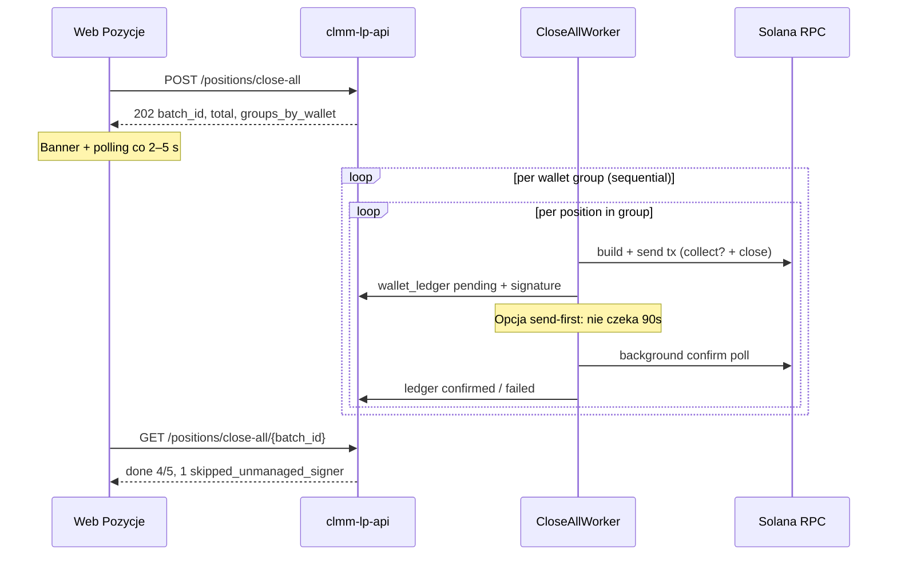

# Zamknięcie wszystkich pozycji (Close All) — plan implementacji

**Status:** accepted (spec + plan rev. 2; **implementacja w PR-ach poniżej**)  
**Data:** 2026-05-20 (rev. 2 — audyt kodu: §4.3 owner, §4.4 executor, ledger)  
**UI:** ekran **Pozycje** (`/positions`) — przycisk „Zamknij wszystkie”  
**API (docelowo):** `POST /positions/close-all`, `GET /positions/close-all/{batch_id}`

**Powiązane:** [`UI_REQUIREMENTS_PHASE1.md`](UI_REQUIREMENTS_PHASE1.md) §3/§5, [`MULTI_WALLET_IMPLEMENTATION_PLAN.md`](MULTI_WALLET_IMPLEMENTATION_PLAN.md), [`MULTI_WALLET_MANUAL_RUNBOOK.md`](MULTI_WALLET_MANUAL_RUNBOOK.md), [`POSITION_REGISTRY.md`](POSITION_REGISTRY.md), [`WALLET_GL.md`](WALLET_GL.md), [`FUNCTIONAL_SPECIFICATION.md`](FUNCTIONAL_SPECIFICATION.md) §1, [`ORCA_API_SERVICE_CONTRACT.md`](ORCA_API_SERVICE_CONTRACT.md)

**keywords:** close-all, bulk-close, positions, batch-job, multi-wallet, active-signer, owner_pubkey, send-first, wallet-ledger, positions-ui, async-on-chain

---

## 1. Streszczenie

Operator na ekranie **Pozycje** potrzebuje **jednej akcji**, która zamknie **wszystkie pozycje widoczne w monitorze API** (nie pełny skan RPC portfela), **bez wielominutowego blokowania przeglądarki**.

Dziś zamknięcie działa tylko **pojedynczo** na stronie szczegółów (`DELETE /positions/{address}`) i każde wywołanie czeka na **pełne send+confirm** on-chain (do ~90 s na transakcję, często **2 tx na pozycję**: collect + close).

Ten dokument definiuje:

1. **Model wielu portfeli** — pozycje mogły powstać z różnych keypairów / podpisów; close musi użyć **właściwego signera per pozycja**.
2. **Model wysyłki on-chain** — job w tle, odpowiedź HTTP natychmiastowa, opcjonalnie **send-first** (confirm w tle).
3. **Kontrakt API + UI** oraz **fazy implementacji**.

| Aspekt | Dziś (2026-05-20) | Docelowo |
| ------ | ----------------- | -------- |
| Zamknięcie z listy pozycji | Brak | Przycisk „Zamknij wszystkie” + podsumowanie batch |
| Wywołanie API | `DELETE /positions/{addr}` — sync, 1 pozycja | `POST /positions/close-all` — **202 + batch_id** |
| Czas oczekiwania UI | N× (2× confirm) — minuty, timeout HTTP | **< 1 s** (start job); postęp przez polling / ledger |
| Signer | Jeden **active signer** / env keypair | **Grupowanie per owner** + mapowanie na plik portfela API |
| Pozycje spoza portfeli API | Close server-side fail | Jawny status `skipped_unmanaged_signer` + ścieżka unsigned (roadmap) |

---

## 2. Kontekst: skąd bierze się lista „do zamknięcia”

**Zakres domyślny (v1):** pozycje z `GET /positions` — monitor API + otwarte wpisy registry + adresy ze strategii `running` (tylko żywe on-chain). To **nie** jest sekcja „Pozycje Orca on-chain (RPC)” z ręcznym `owner` — tam operator skanuje **jeden** wybrany portfel.

**Wyłączenia (nie zamykamy automatycznie):**

- Pozycje już oznaczone `registry_close` (lista API i tak je filtruje).
- Adresy wyłączone parametrem `exclude_addresses` (opcjonalnie w request).
- Pozycje, dla których **nie da się rozwiązać signera zamknięcia** (patrz §4).

---

## 3. Dlaczego nie wysyłać z frontu (pętla `DELETE`)

| Problem | Skutek |
| ------- | ------ |
| Sync `send_and_confirm` w executorze | ~15–90 s **na tx**; przy 5 pozycjach × 2 tx = **minuty** |
| Timeout HTTP | API `onchain_request_timeout_secs` (~120 s) **na jeden** request; front `fetchJsonLong` ~180 s |
| Jeden portfel podpisujący | Równoległe `DELETE` z tego samego signera → kolizje kont / wyścigi ze strategiami |
| Brak jednego `batch_id` | Trudny audyt, rozproszone wpisy w wallet ledger |

**Wniosek:** zamknięcie zbiorcze to **job serwerowy**, nie pętla w React.

---

## 4. Model wielu portfeli i podpisu (obowiązkowy)

### 4.1 Pojęcia (rozróżnij)

| Pojęcie | Znaczenie | Skąd w repo |
| ------- | --------- | ----------- |
| **`position_owner`** | Właściciel NFT pozycji Whirlpool on-chain (kto musi autoryzować close) | **Nie** ufaj `PositionResponse.owner` / `on_chain.owner` (dziś często `111111…`) — patrz §4.3 i §4.6 |
| **`close_signer`** | Keypair, który **podpisze i opłaci** transakcję close (fee payer) | Dla server-side close: zwykle **ten sam** co owner; musi być dostępny na hoście API |
| **`active_signer`** | Wybrany portfel API (`POST /wallets/active-signer`) | [`MULTI_WALLET_MANUAL_RUNBOOK.md`](MULTI_WALLET_MANUAL_RUNBOOK.md) |
| **`registry owner`** | `owner_pubkey` zapisany przy `registry_open` | [`POSITION_REGISTRY.md`](POSITION_REGISTRY.md) |

**Norma Whirlpool:** `close_position_instructions(..., Some(payer))` wymaga, aby **`payer` = owner pozycji** (patrz komentarz w `crates/protocols/src/orca/executor.rs`).

### 4.2 Skąd biorą się pozycje z różnych portfeli

| Ścieżka open | Typowy owner | Czy API może zamknąć server-side? |
| ------------ | ------------ | ----------------------------------- |
| `POST /positions` przy **active signer A** | pubkey A | Tak, jeśli plik `A.json` jest w `/wallets` |
| Open po **przełączeniu** active signer na B | pubkey B | Tak, jeśli B jest w storage API |
| CLI `orca-position-open` z `--keypair` / env | pubkey z CLI | **Tylko** jeśli ten keypair jest też w katalogu portfeli API |
| **`/tx/open/build` + Phantom** (unsigned) | pubkey operatora w przeglądarce | **Nie** server-side — wymaga unsigned batch lub ręcznego close |
| Bot / strategia z executor wallet | pubkey executora strategii | Tak, gdy executor używa portfela z API storage |

**Wniosek:** „Zamknij wszystkie” **nie może** zakładać jednego globalnego active signera dla całej listy. Trzeba **rozwiązać signera per pozycja**.

### 4.3 Algorytm rozwiązania signera (normatywny — skorygowany względem kodu 2026-05-20)

Dla każdej pozycji `P` wylicz **`owner_effective`** (pubkey base58) w tej kolejności — **pierwsze niepuste, poprawne (≠ system program / default)** wygrywa:

| Krok | Źródło | Implementacja (P1) |
| ---- | ------ | ------------------ |
| 1 | **Registry** | Ostatni `registry_open` dla `P` → `owner_pubkey` ([`POSITION_REGISTRY.md`](POSITION_REGISTRY.md), replay jak w `list_positions` / `registry_stale_reconcile`) |
| 2 | **Lifecycle open** | Ostatni `bot_open_position` / `position_open` dla `P` → `fee_payer` lub `owner_pubkey` z `details` |
| 3 | **Strategia running** | Jeśli `P` ∈ `parameters.position_addresses` strategii ze statusem running → `wallet_pubkey()` executora tej strategii (gdy executor ma wallet) |
| 4 | **RPC — właściciel NFT** | Odczyt konta pozycji → `position_mint` → owner token account mintu (Token / Token-2022). **Nowy helper** — patrz §4.6 |
| 5 | **Brak** | Item → `skipped_unmanaged_signer`; batch kontynuuje (partial OK) |

Następnie:

6. **`wallet_id`** ← dopasowanie `owner_effective` do `GET /wallets` (`WalletEntry.pubkey`), przez istniejące store (`load_wallet_keypair_from_stores` w `handlers/wallets.rs`).
7. Jeśli brak pliku keypair na hoście API → **`skipped_unmanaged_signer`** (Phantom, CLI spoza storage).
8. Inaczej → **`close_signer_wallet_id`** + **`close_signer_pubkey`** = ten portfel.

**Nie używaj** jako pierwszego źródła:

- `MonitoredPosition.on_chain.owner` — w [`position_reader.rs`](../../crates/protocols/src/orca/position_reader.rs) ustawiane na `Pubkey::default()` z TODO „fetch from token account”.
- **`active_signer`** — tylko gdy explicite brak innych źródeł i polityka operatora (poza v1).

**Kolejność w batch:** grupuj po `close_signer_wallet_id`; **wewnątrz grupy** zamykaj sekwencyjnie (jeden fee payer, mniejsze ryzyko kolizji).

**Równoległość (P4):** niezależne grupy (różni ownerzy) mogą iść **równolegle** (osobne taski + osobne executory z właściwym keypair), o ile limit RPC na to pozwala.

### 4.4 Executor i izolacja portfela (P1 — wymagane)

Dziś `DELETE /positions/{address}` zawsze woła `resolve_executor_for_position_ops()` → **jeden** współdzielony executor (`__api_position_ops__`) z walletem = active signer / env. To **psuje się**, gdy owner pozycji ≠ active signer; batch musi to naprawić explicite.

**Norma P1 (wybierz wariant A — preferowany):**

- **`close_position_with_wallet(state, address, wallet: Arc<Wallet>, …)`** — buduje **efemeryczny** `StrategyExecutor` (lub `PositionService`) z podanym keypair, **bez** mutacji globalnego `active_signer` i **bez** `set_wallet` na współdzielonym executorze używanym przez inne requesty.
- Worker batch: dla każdej grupy `wallet_id` → `load_wallet_keypair_from_stores` → pętla close z tym walletem.

**Wariant B (akceptowalny, gorzej):** globalny **`tokio::sync::Mutex`** `position_ops_close` + tymczasowe `set_wallet` na `__api_position_ops__` executorze **tylko** w sekcji krytycznej worker batch. Wymaga blokady równoległych `DELETE /positions/*`, open i innych ops na tym samym executorze.

**Zakaz:** zmiana `active_signer` w `AppState` na czas batch.

**Bonus P1:** ten sam resolver + `close_position_with_wallet` podpiąć pod **`DELETE /positions/{address}`** (fix istniejącego buga single close).

### 4.5 Active signer a batch

- **Nie** ustawiaj globalnie active signera na cały batch (psuje inne operacje równoległe).
- Worker ładuje keypair **per `wallet_id`** (§4.4), nie przez `load_wallet_from_active_signer_or_env`.
- Po zakończeniu batch **nie zmienia** trwałego `active_signer` w state.

### 4.6 Luka w kodzie: `PositionResponse.owner`

`GET /positions` zwraca `owner: p.on_chain.owner.to_string()`, ale reader **nie wypełnia** ownera pozycji. UI **nie powinno** polegać na tej kolumnie do grupowania portfeli.

**P1 backend:**

- Resolver §4.3 w API (source of truth dla batch).
- Opcjonalnie **P2:** pole `close_signer_preview` w odpowiedzi `POST /positions/close-all` (dry preview) lub osobny `POST …/close-all/preview` z grupami przed startem.
- **P2+:** naprawa `PositionReader` / uzupełnienie ownera NFT w monitorze (osobny task, nie blokuje batch).

### 4.7 Pozycje bez portfela na hoście API (Phantom / zewnętrzny)

**v1:** pomijane z czytelnym komunikatem w UI i w `batch.items[]`.

**v2 (roadmap):** tryb **`mode: "unsigned"`** — API zwraca listę `BuildUnsignedTxResponse` per pozycja (`POST /tx/close/build`), operator podpisuje w Phantom po kolei; `POST /tx/submit-signed` + ledger correlation przez `batch_id`. Nie blokuje implementacji server-side batch.

---

## 5. Strategia wysyłki on-chain (szybko, bez czekania w UI)

### 5.1 Architektura joba



### 5.2 Fazy wysyłki (implementacja)

| Faza | Zachowanie | Zysk czasu | Ryzyko |
| ---- | ---------- | ---------- | ------ |
| **A — sync confirm (MVP backend)** | Jak dziś `execute_full_close_only`, sekwencja w workerze | UI nie czeka (202), ale job trwa minuty | Niskie — reuse kodu |
| **B — send-first** | `send_transaction` + watcher confirm; ledger `pending` → `confirmed` | ~3–5× krótszy pipeline per tx | Średnie — trzeba domknąć lifecycle/registry po confirm |
| **C — skip pre-collect (bulk-only)** | Jedna tx close (Orca SDK zbiera fee w close); bez osobnego `collect_fees` | −50% tx | Brak osobnego wiersza `bot_collect_fees` — akceptowalne przy mass exit |
| **D — parallel groups** | Równoległe taski per `wallet_id` | Skala przy wielu portfelach | RPC rate limit; więcej równoczesnych strategii |

**Rekomendacja:** wdrożyć **A + UI polling**, potem **B**, opcjonalnie **C** za flagą `bulk_close_options.skip_pre_collect`.

### 5.3 Kroki przed zamknięciem (polityka operacyjna)

1. **Opcjonalnie `pause_linked_strategies`** (domyślnie `true` w v1): dla każdego PDA z batch dopisz adres do `executor_disabled_position_addresses` na **podpiętych** strategiach — bot nie rebalance’uje **tej** pozycji w trakcie close. **Nie** zatrzymuje całej strategii ani innych PDA tej strategii; inne pozycje tego samego portfela nadal mogą się ruszać (policy 3A — akceptowalne na v1, opis w confirm UI).
2. **Dry-run:** gdy `API dry_run=true`, batch zwraca symulację bez tx (jak pojedyncze close).
3. **Idempotencja:** pozycja już zamknięta on-chain → `already_closed` (reuse logiki z `position_service.close_position`).

### 5.4 Księgowość i obserwowalność

- Wspólny **`batch_id`** (UUID) w:
  - odpowiedzi API job,
  - polu `correlation_id` / rozszerzeniu `details` w wallet ledger (`kind=close_position`),
  - opcjonalnie `close_kind=manual_bulk` w lifecycle `details`.
- **Wallet ledger `owner`:** dla każdego itemu **`owner` = `close_signer_pubkey`** (portfel, który podpisał tx), **nie** `position_ops_wallet_owner()` / active signer. Dziś handler close bierze owner z executora globalnego — batch musi przekazać explicit owner per item.
- UI: link do **Dziennik portfela** z filtrem `kind=close_position` + podgląd batch.
- Po każdym udanym close: istniejące kroki (registry close, unlink strategii, `spawn_chain_history_materialize_background`).

---

## 6. Kontrakt API (docelowy)

### 6.1 `POST /positions/close-all`

**Timeout routera:** krótki (zwykły request), **nie** on-chain — handler tylko zakolejkowuje job.

**Request (propozycja):**

```json
{
  "scope": "monitored",
  "addresses": [],
  "exclude_addresses": [],
  "pause_linked_strategies": true,
  "options": {
    "skip_pre_collect": false,
    "send_mode": "confirm_sync"
  }
}
```

| Pole | Opis |
| ---- | ---- |
| `scope` | `monitored` (domyślnie) = ta sama lista co `GET /positions`; `explicit` = tylko `addresses` |
| `pause_linked_strategies` | Przed startem wyłącz automatykę na dotkniętych PDA |
| `options.send_mode` | `confirm_sync` (faza A) → `send_first` (faza B) |
| `options.skip_pre_collect` | Faza C — tylko gdy `true` |

**Response `202`:**

```json
{
  "batch_id": "uuid",
  "status": "queued",
  "total": 5,
  "groups": [
    { "wallet_id": "main-dev", "owner_pubkey": "…", "count": 3 },
    { "wallet_id": "experiment-b", "owner_pubkey": "…", "count": 2 }
  ],
  "skipped_preview": [
    { "address": "…", "reason": "unmanaged_signer", "owner_pubkey": "…" }
  ]
}
```

### 6.2 `GET /positions/close-all/{batch_id}`

```json
{
  "batch_id": "uuid",
  "status": "running",
  "started_ts_utc": "…",
  "finished_ts_utc": null,
  "summary": { "total": 5, "closed": 2, "failed": 0, "skipped": 1, "pending": 2 },
  "items": [
    {
      "address": "…",
      "owner_pubkey": "…",
      "close_signer_wallet_id": "main-dev",
      "status": "confirmed",
      "signature": "…",
      "error": null
    }
  ]
}
```

Statusy item: `queued` | `pending_on_chain` | `confirmed` | `failed` | `skipped_unmanaged_signer` | `already_closed`.

### 6.3 Kompatybilność wsteczna

- **`DELETE /positions/{address}`** pozostaje endpointem pojedynczego close; **P1** dodaje ten sam resolver owner co batch (fix: active signer ≠ owner pozycji).
- Bulk **nie zastępuje** reconcile martwego registry (`POST /positions/reconcile-stale`).

---

## 7. Kontrakt UI

### 7.1 Ekran Pozycje

- Przycisk **„Zamknij wszystkie”** (destructive), widoczny gdy `positions.length > 0`.
- **`window.confirm`** (spójnie z `PositionDetail`) z podsumowaniem:
  - liczba pozycji,
  - **podział per portfel** z **`groups` / preview API** (§6.1) — **nie** z kolumny `owner` w tabeli listy (może być `111111…`),
  - ostrzeżenie o pozycjach **pominiętych** (brak keypair na API).
- Po starcie: banner **„Zamykanie w tle (batch …)”** + pasek postępu `closed+failed+skipped / total`.
- Polling `GET /positions/close-all/{batch_id}` co 2–5 s; invalidacja `['positions']` po `status=done`.
- i18n PL/EN (`positions.closeAll`, …).

### 7.2 Czego UI nie robi (v1)

- Nie wywołuje N× `DELETE` sekwencyjnie.
- Nie zamyka pozycji z sekcji **on-chain scan** (inny owner / inny kontekst) — tam osobna akcja „zamknij widoczne” to **future**.

---

## 8. Plan implementacji (PR-y)

### Faza P0 — dokumentacja i kontrakt

- [x] Ten dokument (+ korekta §4.3–§4.6, executor, ledger — 2026-05-20).
- [x] Aktualizacja indeksu `doc/README.md`, `UI_REQUIREMENTS_PHASE1.md`, cross-linki multi-wallet.
- [x] Szkic wpisu w `FUNCTIONAL_SPECIFICATION.md` §1.

### Faza P1 — backend batch (MVP)

| # | Zadanie | Pliki (orientacyjnie) |
| - | ------- | --------------------- |
| 1 | Model job + **in-memory** store (jak backtest jobs); dokumentuj utratę statusu po restarcie API | `models.rs`, `state.rs` |
| 2 | **`resolve_close_signer_for_position`** — kolejność §4.3 (registry → lifecycle → strategy executor → RPC NFT owner) | `services/position_close_signer.rs` (nowy) |
| 3 | Helper **RPC NFT owner** (position PDA → mint → token account owner) | `protocols` lub `api/services` |
| 4 | **`close_position_with_wallet`** + opcjonalnie ten sam resolver dla **`DELETE /positions/{addr}`** | `position_service.rs`, `handlers/positions.rs` |
| 5 | `POST/GET close-all`; response `groups` + `skipped_preview` przed startem job | `handlers/positions.rs`, `routes.rs`, `openapi.rs` |
| 6 | Worker: grupy per `wallet_id`, sekwencja, **`close_position_with_wallet`**; ledger z **`close_signer_pubkey`** | `services/position_close_all_worker.rs` |
| 7 | `pause_linked_strategies` — `executor_disabled_position_addresses` per PDA (§5.3) | `strategy_service.rs` |
| 8 | Testy: registry-first owner, active signer ≠ owner, skip unmanaged, ledger owner, dry-run | `crates/api/src/services/*` |

**Kryterium done P1:** `POST /positions/close-all` → 202; job zamyka z **właściwym** keypair per grupa; `DELETE` single close też resolvuje owner gdy active signer ≠ owner; restart API nie psuje on-chain (job może zniknąć — patrz §10).

### Faza P2 — frontend

| # | Zadanie | Pliki |
| - | ------- | ----- |
| 1 | API client + typy | `web/src/lib/api.ts` |
| 2 | Przycisk + confirm + progress | `web/src/pages/Positions.tsx` |
| 3 | i18n | `web/src/lib/i18n.tsx` |

### Faza P3 — send-first + skip pre-collect

**Plan szczegółowy (PR SF-PR1…SF-PR5):** [`CLOSE_ALL_SEND_FIRST_IMPLEMENTATION_PLAN.md`](CLOSE_ALL_SEND_FIRST_IMPLEMENTATION_PLAN.md)

| # | Zadanie | Status (2026-05-21) |
| - | ------- | --------------------- |
| 1 | `skip_pre_collect` + `execute_bulk_close_only` | **done** (bulk domyślnie 1 tx) |
| 2 | Równoległe grupy portfeli | **done** |
| 3 | `send_mode: send_first` — send + confirm watcher | **plan** — patrz doc powyżej |
| 4 | Statusy batch `submitted` / `confirming` + UI signature | **plan** |
| 5 | `finalize_close_after_confirm` (lifecycle, registry po confirm) | **plan** |

### Faza P4 — rozszerzenia

- Równoległe grupy portfeli (limit konfigurowalny).
- Unsigned batch dla Phantom (`mode: unsigned`).
- Persystencja job w Postgres (opcjonalnie).

---

## 9. Testy i weryfikacja

| Scenariusz | Oczekiwanie |
| ---------- | ----------- |
| 3 pozycje, ten sam owner (registry), portfel w API | 3× close, jedna grupa, job `done` |
| 2 pozycje, owner A + owner B (registry), oba w `/wallets` | 2 grupy, sekwencja w grupie; opcjonalnie parallel w P4 |
| 1 pozycja Phantom (owner spoza API) | `skipped_unmanaged_signer`; pozostałe zamknięte |
| Active signer = C, pozycja owner A (registry) | Close używa **A**, nie C; ledger `owner` = A |
| Brak registry, tylko RPC NFT owner | Resolver krok 4 → poprawny `wallet_id` |
| Strategia running na PDA | Po `pause_linked_strategies=true` brak rebalance **tego** PDA w trakcie |
| Dry-run API | Brak tx; preview grup |
| Pozycja już closed on-chain | `already_closed`, monitor wyczyszczony |
| Restart API w trakcie job | On-chain tx mogą dojść; status batch może zniknąć — sprawdź ledger / listę |

**Manual:** devnet / mały mainnet — porównaj wallet ledger + registry + lista `/positions` po batch.

---

## 10. Ryzyka i poza zakresem

| Ryzyko | Mitigacja |
| ------ | --------- |
| RPC wolny / confirm timeout | send-first; retry per item; partial batch OK |
| Operator myli monitor z pełnym portfelem | Confirm text + docs; scope=`monitored` |
| Utrata active signer mid-batch | Worker nie polega na globalnym active signer |
| Multi-wallet conflict storage | [`MULTI_WALLET_MANUAL_RUNBOOK.md`](MULTI_WALLET_MANUAL_RUNBOOK.md) — nie close przy `conflict` |
| **`on_chain.owner` pusty w liście pozycji** | Resolver §4.3; UI nie używa kolumny owner do confirm |
| **Restart API (in-memory job P1)** | Tx on-chain mogą być `confirmed` mimo utraty batch; operator: wallet ledger + `GET /positions` |
| Współdzielony executor vs równoległe ops | `close_position_with_wallet` (§4.4) lub mutex |

**Poza v1:** zamknięcie pozycji spoza monitora; automatyczny sweep wszystkich NFT z `orca-positions-list` bez explicit confirm per owner.

---

## 12. Research branżowy (co robią inni — 2026-05-20)

Zebrane z dokumentacji protokołów, SDK i narzędzi operatorskich. **Nie** zastępuje audytu kodu — wskazuje wzorce rynkowe pod kątem naszego planu (§4–§5).

### 12.1 Orca Whirlpool (najbliższy protokół)

| Źródło | Co robią | Wniosek dla nas |
| ------ | -------- | --------------- |
| [Portfolio UI](https://docs.orca.so/liquidity/manage/portfolio) | **Harvest All** — zbiera fee ze **wszystkich** pozycji portfela **jedną transakcją**; **Close** tylko z menu **⋯ per pozycja** | Brak natywnego „Close All” w UI Orca; zbiorowość jest na **harvest**, nie na exit |
| [Close Position SDK](https://docs.orca.so/developers/sdks/positions/close-position) / [`closePositionInstructions`](https://dev.orca.so/ts/functions/_orca-so_whirlpools.closePositionInstructions.html) | Jedno wywołanie SDK = instrukcje: **collect fees + rewards + decrease + close NFT** (authority = owner) | **1 tx na pozycję** wystarczy — osobny pre-`collect_fees` w naszym `execute_full_close_only` to **polityka ledgera**, nie wymóg protokołu (spójne z opcją `skip_pre_collect` w §5.2) |
| [Monitor positions](https://docs.orca.so/developers/sdks/positions/monitor-positions) | `fetch_positions_for_owner` → lista NFT → pętla operacji | Wzorzec botów: **scan owner → loop close** (jak nasz worker, nie N× HTTP z UI) |
| [Position NFTs](https://docs.orca.so/liquidity/manage/portfolio) | Owner NFT = kontrola pozycji; transfer NFT = transfer pozycji | Multi-wallet = **różni ownerzy NFT**, nie „jeden signer dla wszystkiego” (potwierdza §4) |

### 12.2 Raydium CLMM

| Źródło | Co robią | Wniosek |
| ------ | -------- | ------- |
| [Raydium SDK V2 demo — CLMM](https://github.com/raydium-io/raydium-sdk-V2-demo/tree/master/src/clmm) | `getOwnerPositionInfo()` → filtr puli → `closePosition` + `execute({ sendAndConfirm: true })` per pozycja | **Sekwencyjna pętla** w kodzie; brak oficjalnego „close all” |
| [Dialect API — remove liquidity](https://docs.dialect.to/api-reference/raydium/clmm/remove-liquidity-post) | REST per pozycja (% withdrawal) | Integracje zewnętrzne też idą **po jednej pozycji** |
| Boty community (np. [raydium-clmm-bot](https://github.com/himanshuranjan007/raydium-clmm-bot)) | Cron: fetch positions → OOR check → close + reopen | Ten sam model co nasz executor: **monitor loop**, nie sync REST do przeglądarki |

### 12.3 Meteora DLMM

| Źródło | Co robią | Wniosek |
| ------ | -------- | ------- |
| [Meteora SDK — removeLiquidity](https://docs.meteora.ag/developer-guide/guides/dlmm/typescript-sdk/sdk-functions) | `shouldClaimAndClose: true` — claim + close w jednym kroku | Podobnie jak Orca: **zbiorczy krok per pozycja**, nie „wszystkie naraz” |
| [CHANGELOG dlmm-sdk](https://github.com/MeteoraAg/dlmm-sdk/blob/main/CHANGELOG.md) | Batch helpers głównie przy **open / rebalance** (`initializeMultiplePosition…`); limity rozmiaru tx (~525 binów) | **Batch on-chain** dotyczy głównie **tworzenia** pozycji, nie masowego zamykania |
| Boty Telegram (np. Meteora LP boty) | Jeden `SOLANA_PRIVATE_KEY` → close interaktywnie per pozycja | Single-wallet assumption — słabe dla naszego multi-wallet (§4) |

### 12.4 Narzędzia third-party (Solana)

| Narzędzie | Zachowanie | Ograniczenia |
| --------- | ---------- | ------------ |
| [GTokenTool — batch remove](https://docs.gtokentool.com/solana/liquidity-management/batch-remove-liquidity) | Skan portfela → checkboxy → **batch w UI**, podpis w **podłączonym walletcie** | Dziś głównie **PumpSwap**, nie Orca/Raydium; fee ~0.001 SOL / removal |
| [Mobula — batch wallet positions API](https://docs.mobula.io/changelog/2026-01-11) | Do **100 pozycji** w jednym **odczycie** (`getMultipleAccounts`) | Optymalizacja **read**, nie write/close |
| Agregatory (Zerion itd.) | Multichain **read** pozycji | Brak standardu „close all LP” — operatory robią własne pętle |

### 12.5 Solana — wysyłka wielu transakcji

| Temat | Praktyka branżowa | Zastosowanie u nas |
| ----- | ----------------- | ------------------ |
| [Transaction pipeline](https://solana.com/docs/core/transactions/transaction-pipeline) | Tx przechodzi weryfikację, budżet CU, commit | Przy wielu close: liczyć **CU + rozmiar** — rzadko wiele close w **jednej** tx |
| [Blockhash / expiry](https://docs.solana.com/developing/transaction_confirmation) | ~150 slotów (~60–90 s) ważności | Sync confirm w pętli = **wąskie gardło**; uzasadnia send-first (§5.2) |
| [Batch payments](https://solana.com/docs/payments/send-payments/payment-processing/batch-payments) | Wiele **instrukcji w jednej tx** — atomowo | Teoretycznie możliwe dla 2–3 prostych close; CLMM close jest **ciężki** (konta, CU) → **1 pozycja ≈ 1 tx** to norma |
| [Durable nonces](https://solana.com/docs/core/transactions/durable-nonces) | Offline / opóźniony submit; **1 nonce = 1 pending tx** | Raczej pod signing asynchroniczny niż masowy close; opcjonalnie v2+ dla Phantom batch |

### 12.6 Boty / frameworki (Hummingbot itd.)

- **Hummingbot v2 LP executor:** cykl open → monitor → rebalance → **close pojedynczej** pozycji w strategii ([executors docs](https://hummingbot.org/strategies/v2-strategies/executors/)); brak uniwersalnego „close all portfolio”.
- **Wzorzec wspólny:** executor w procesie długożyciowym, **kolejka decyzji**, confirm on-chain w tle — bliżej naszego **job workera** niż REST sync z dashboardu.

### 12.7 Wzorce UX / API (poza on-chain)

| Wzorzec | Przykłady | Rekomendacja |
| ------- | --------- | ------------ |
| **Job + polling** | Backtest jobs w naszym API, GTokenTool „batch” z progressem w UI | `202` + `GET …/batch_id` (§6) — **standard de facto** dla długich tx |
| **Wallet-side signing** | Orca portfolio, GTokenTool | Dla pozycji **spoza** keypair API → unsigned build + submit (§4.5 v2) |
| **Harvest before exit** | Orca „Harvest All” osobno od close | Przy mass exit można rozważyć opcjonalny **pre-harvest all** (1 tx) przed serią close — **opcjonalne**, nie w v1 |
| **Polling interwał** | DeFi dashboard guides ~30–60 s dla sald | Dla close batch: **2–5 s** (krótszy, bo tx kończą się w minutach) |

### 12.8 Synteza — co warto skopiować

1. **Nie czekać w przeglądarce** — wszyscy (SDK demo, boty, narzędzia batch) robią pętlę **poza** UI lub z podpisem lokalnym + krótkim feedbackiem.
2. **Brak „magicznego” jednego tx na 20 pozycji CLMM** — nawet Orca „Harvest All” to inna operacja; close = **N transakcji** (ew. kilka instrukcji w tx tylko dla **jednej** pozycji).
3. **Authority = owner portfela** — SDK Orca/Raydium explicite; multi-wallet wymaga **grup po owner** (§4), nie jednego active signera.
4. **Uprościć ścieżkę tx** — industry close ≈ **jedna tx z pełnym close**; nasz podwójny collect+close to dobre do audytu, ale do bulk warto `skip_pre_collect` (§5.2 C).
5. **Orca UI nie ma Close All** — nasza funkcja to **operator tooling** (dashboard bota), nie paritet z oficjalnym Orca portfolio; UX można wzorować na **Harvest All + confirm z listą**.

**Źródła zewnętrzne (linki):**

- Orca portfolio / harvest: https://docs.orca.so/liquidity/manage/portfolio , https://docs.orca.so/liquidity/manage/harvest  
- Orca SDK close: https://dev.orca.so/ts/functions/_orca-so_whirlpools.closePositionInstructions.html  
- Raydium CLMM demo: https://github.com/raydium-io/raydium-sdk-V2-demo/tree/master/src/clmm  
- Meteora SDK: https://docs.meteora.ag/developer-guide/guides/dlmm/typescript-sdk/sdk-functions  
- Solana tx / batch: https://solana.com/docs/core/transactions/transaction-pipeline , https://solana.com/docs/payments/send-payments/payment-processing/batch-payments  
- GTokenTool batch remove: https://docs.gtokentool.com/solana/liquidity-management/batch-remove-liquidity  

---

## 13. Checklist przed merge (AI / operator)

- [ ] `doc/README.md` — wiersz w indeksie
- [ ] `UI_REQUIREMENTS_PHASE1.md` — §3/§5 zaktualizowane
- [ ] `FUNCTIONAL_SPECIFICATION.md` §1 — norma close-all
- [ ] Po implementacji kodu: wpis w `ENGINEERING_NOTES.md` (`keywords: close-all, multi-wallet, …`)
- [ ] OpenAPI: nowe endpointy w `openapi.rs`
