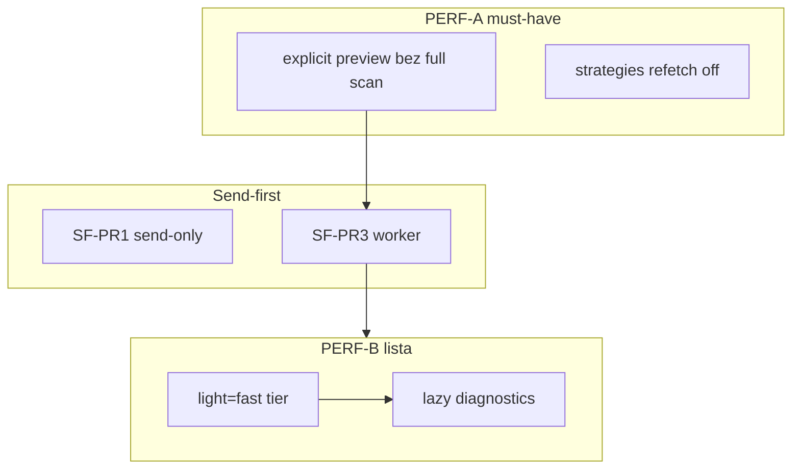

# Ekran Pozycje — wydajność wczytywania (plan)

**Status:** accepted (plan)  
**Data:** 2026-05-21  
**Problem zgłoszony:** lista pozycji czasami ładuje się bardzo długo; po dodaniu zamknięcia zbiorczego wrażenie regresji.

**Powiązane:** [`CLOSE_ALL_SEND_FIRST_IMPLEMENTATION_PLAN.md`](CLOSE_ALL_SEND_FIRST_IMPLEMENTATION_PLAN.md) (wspólny budżet RPC), [`POSITIONS_CLOSE_ALL_IMPLEMENTATION_PLAN.md`](POSITIONS_CLOSE_ALL_IMPLEMENTATION_PLAN.md), [`ENGINEERING_NOTES.md`](ENGINEERING_NOTES.md) wpisy 2026-05-20 `list_positions` / B4 / light restore

**keywords:** positions-ui, list_positions, light, N+1, stream-pnl, position-diagnostics, close-all-preview, RPC, performance, Positions.tsx

---

## 1. Oczekiwanie operatora

| Metryka | Cel (dev, typowy RPC) |
|---------|------------------------|
| Pierwsza tabela pozycji widoczna | **&lt; 3 s** (adresy, pary, zakres in/out) |
| Wartość / fee USD w wierszach | **&lt; 8 s** (bez blokowania całej strony) |
| Kolumny Strategia / Agent | **&lt; 15 s** lub lazy (nie blokują tabeli) |
| Otwarcie confirm „Zamknij wybrane” | **&lt; 2 s** preview (tylko zaznaczone PDA) |

---

## 2. Co było „wczoraj” (2026-05-20) — timeline

| Faza | Zmiana | Efekt na czas |
|------|--------|----------------|
| **B4** | `GET /positions?light=1` **bez** `compute_position_usd_valuation` | **Najszybsze** — wartości z monitora, często $0 |
| **C** | UI **bez** N× `stream-pnl` | Szybszy front |
| **Restore light valuation** | `light=1` znowu **równoległe** `compute_position_usd_valuation` (concurrency 6) | Poprawne $ i fee, **wolniejsze** API (N× RPC valuation) |
| **Restore stream-pnl w UI** | `useQueries` → N× `GET .../stream-pnl` w tle | Poprawny PnL %, **+N requestów** |
| **Close-all UI** | Preview + batch polling | **+1 ciężki POST** przy confirm; **+polling 4 s** przy trwającym batchu |

**Wniosek:** wczorajsza „naprawa” priorytetyzowała **poprawność kolumn** (wartość, fee, PnL), nie minimalny czas. Close-all **nie spowalnia** samego `GET /positions`, ale **konkuruje o RPC** i dodaje **dodatkowe** ciężkie wywołania.

---

## 3. Diagnoza — warstwy

### 3.1 Backend `GET /positions` (domyślnie `light=1`)

**Plik:** `crates/api/src/handlers/positions.rs`

Każde odświeżenie listy:

1. Monitor + merge registry + running strategies  
2. `fetch_supplement_positions_parallel` (RPC, concurrency 6)  
3. `fetch_prices_for_positions` (batch)  
4. **Per pozycja:** `compute_position_usd_valuation` równolegle (light path)  
5. `monitored_position_list_row` per wiersz  

Przy **N=10** pozycji to często **10+ RPC valuation** + supplement — **30–60 s** na wolnym publicznym RPC jest możliwe.

### 3.2 Frontend N+1 (`Positions.tsx`)

Dla **każdej** pozycji po załadowaniu listy (równolegle):

| Query | Endpoint | Blokuje tabelę? |
|-------|----------|-----------------|
| `position-stream-pnl` | `GET /positions/{addr}/stream-pnl` | Nie (`isLoading` tylko na `getPositions`) |
| `position-diagnostics` | `GET /positions/{addr}/diagnostics` | Nie — ale wiersz pokazuje „Sprawdzanie…” |
| `position-agent-ui` | `GET /positions/{addr}/agent/...` | Nie |

**Efekt UX:** tabela **jest**, ale użytkownik czeka na kolumny Strategia/Agent/PnL — **wrażenie „długiego ładowania”**.

Dodatkowo: `strategiesQ` — `refetchOnMount: 'always'`, co **15 s** (dodatkowy ruch).

### 3.3 Close-all — regresja preview (wysoka pewność)

**Plik:** `crates/api/src/services/position_close_all.rs`

```rust
async fn resolve_close_all_addresses(...) {
    let monitored = collect_monitored_position_addresses(state).await; // ZAWSZE
    apply_scope_and_excludes(req, monitored)
}
```

Przy `scope=explicit` i **2 zaznaczonych** PDA preview i tak robi **pełny skan** monitora + supplement (ten sam koszt co `GET /positions`).

**UI:** `postCloseAllPositionsPreview` timeout **60 s** — operator może czekać minutę na panel confirm.

**Batch polling:** `GET /close-all/{id}` co **4 s** — przy trwającym zamknięciu dodatkowe obciążenie API (lekki, ale + RPC jeśli worker też żre RPC).

### 3.4 Konkurencja RPC (close-all + lista)

Worker close-all + `list_positions` + N× stream-pnl + preview **dzielą** ten sam `RpcProvider` → kolejkowanie → **oba** wydają się wolniejsze.

---

## 4. Plan naprawczy (PR-y)

### Fala PERF-A — szybkie wins (1–2 dni, przed / równolegle z send-first)

| PR | Zadanie | Pliki | Efekt |
|----|---------|-------|-------|
| **PERF-PR1** | **`scope=explicit` bez `collect_monitored`** — preview/start biorą tylko `req.addresses`; opcjonalna walidacja „czy PDA w monitorze” z cache 30 s | `position_close_all.rs` | Confirm zamknięcia **&lt;2 s** zamiast minut |
| **PERF-PR2** | UI: **nie** wołać preview dopóki `selectedCloseCount > 0` i debounce 300 ms; pokazać spinner tylko w panelu confirm | `Positions.tsx` | Mniej przypadkowych POST |
| **PERF-PR3** | `strategiesQ` na stronie Pozycje: `staleTime: 60_000`, wyłączyć `refetchInterval` (albo tylko gdy zakładka aktywna) | `Positions.tsx` | −1 źródło ruchu co 15 s |
| **PERF-PR4** | Batch polling: **8–10 s** gdy `pending > 0`, **stop** gdy karta ukryta (`document.visibilityState`) | `Positions.tsx` | Mniej load w tle |

### Fala PERF-B — lista pozycji (2–4 dni)

| PR | Zadanie | Pliki | Efekt |
|----|---------|-------|-------|
| **PERF-PR5** | **Tier listy:** `light=fast` (tylko monitor + `enrich_pool_ticks`, bez valuation) vs `light=full` (dziś) — UI najpierw `fast`, potem opcjonalnie `refetch` full w tle | `positions.rs`, `api.ts`, `Positions.tsx` | Tabela **&lt;3 s** |
| **PERF-PR6** | **Lazy kolumny:** diagnostics + agent tylko dla wierszy w viewport (IntersectionObserver) lub po rozwinięciu wiersza | `Positions.tsx` | N×3 → ~5–10 requestów |
| **PERF-PR7** | **Batch extras API:** `POST /positions/list-extras` body `{ addresses: [...] }` → strategie + agent status w jednym response | nowy handler, `Positions.tsx` | 2N → 1 request |
| **PERF-PR8** | Stream-pnl: tylko gdy kolumna PnL widoczna lub `metricsMode` wymaga; limit równoległości (np. 3) + queue | `Positions.tsx` | Mniej stormu |

### Fala PERF-C — cache / współdzielenie (opcjonalnie, 2 dni)

| PR | Zadanie | Efekt |
|----|---------|-------|
| **PERF-PR9** | Współdzielony cache supplement monitora (TTL 20–30 s) między `list_positions` a `close-all` | Drugie wywołanie nie powtarza RPC |
| **PERF-PR10** | Env `CLMM_LIST_POSITIONS_LIGHT_VALUATION=0` — wyłącza valuation w light bez zmiany kodu klienta | Ops na wolnym RPC |

---

## 5. Powiązanie z planem send-first

| Obszar | Interakcja |
|--------|------------|
| Send-first worker | Mniej czasu blokady workera, ale **więcej** równoległych RPC (send + confirm watchers) |
| Bez PERF-PR1/9 | Preview + lista + batch **saturują** RPC → lista nadal wolna podczas zamykania |
| Kolejność wdrożenia | **PERF-PR1–4 przed SF-PR3** (send-first worker), potem PERF-B równolegle z SF-PR4 |



---

## 6. Testy i kryteria done

### Automatyczne

| Test | Opis |
|------|------|
| `explicit_scope_skips_monitored_collect` | `resolve_close_all_addresses(explicit, [a,b])` — mock: `collect_monitored` nie wywołane |
| `list_fast_returns_without_valuation` | `light=fast` — brak wywołania `compute_position_usd_valuation` |

### Manual

1. **10 pozycji**, public RPC — wejście na `/positions`: tabela z adresami **&lt;5 s**.  
2. Zaznacz **2** pozycje → confirm: preview grup **&lt;3 s**.  
3. Trwający batch + odśwież listę: lista nadal **&lt;10 s** (po PERF-PR9).  
4. DevTools Network: przy samym wejściu na stronę **≤ 1×** `GET /positions` + **≤ 3** równoległe extras (po PERF-B).

---

## 7. Ryzyka

| Ryzyko | Mitigacja |
|--------|-----------|
| `light=fast` znowu $0 | Drugi etap fetch `full`; badge „uzupełnianie wartości…” |
| Explicit close bez pełnego skanu | Resolver signera per PDA (już jest); nie wymaga pełnej listy |
| Lazy diagnostics — puste chwile | Skeleton w kolumnie Strategia |

---

## 8. Status implementacji (śledzenie)

| PR | Status |
|----|--------|
| PERF-PR1 explicit preview | **done** (2026-05-21) |
| PERF-PR2 debounce preview UI | **done** (2026-05-21) |
| PERF-PR3 strategies refetch | **done** (2026-05-21) |
| PERF-PR4 batch polling | **done** (2026-05-21) |
| PERF-PR5 light=fast | **done** (2026-05-21) |
| PERF-PR6 lazy rows | **done** (2026-05-21) |
| PERF-PR7 list-extras API | **done** (2026-05-21) |
| PERF-PR8 stream-pnl throttle | **done** (2026-05-21, max 3 concurrent visible) |
| PERF-PR9 supplement batch cache | **done** (2026-05-21, TTL 25 s) |

---

## 9. Krótko dla operatora (PL)

- **Wolne ładowanie listy** to głównie **wiele zapytań RPC** (lista + osobno każda pozycja w tle), nie sam przycisk zamknięcia.  
- **Panel zamknięcia** dziś niestety robi **ten sam ciężki skan** co cała lista — to naprawimy w **PERF-PR1**.  
- Po PERF-A/B strona powinna pokazać tabelę **szybko**, a szczegóły (strategia, PnL) **dopinać w tle**.
