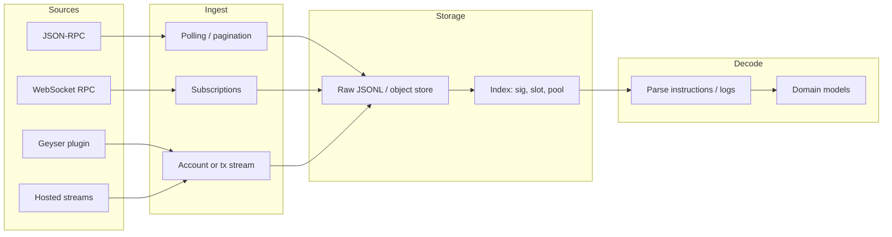

# Solana indexing: concepts and how this repo fits

This document answers a common misconception — whether a **“token duplicating across the network”** can collect transaction information — and summarizes **Solana indexing architecture** (sources, filtering, pull vs push pipelines). It complements the operational narrative in [`PROJECT_OVERVIEW.md`](PROJECT_OVERVIEW.md) and swap sync notes in [`../STARTUP.md`](../STARTUP.md).

---

## Can a “token duplicating across the network” collect transaction information?

**No, not in the sense the phrase suggests.** An SPL token is a **mint and balances on accounts** — it is not a distributed listener for the whole chain and does not “replicate” in a way that observes arbitrary users’ transactions.

**Transactions on a public blockchain are already visible.** To use that information you rely on **off-chain infrastructure**: RPC, log subscriptions, streams (e.g. Geyser), or hosted indexers — which is the direction of the pipelines under `data/` (JSONL: snapshots, swaps).

### What is realistic

1. **Observing only what touches your asset/program**  
   Every transfer, swap, or instruction invoking your program is recorded on-chain. You index by **program id, mint, or PDA** — no “self-replicating token” is required.

2. **A broad view of the network (not just your token)**  
   This requires a **full block/transaction stream** (dedicated validator + plugin, or a provider). Still not a token’s job.

3. **Sending “dust” to many addresses**  
   That can create on-chain activity visible in explorers, but it is often **spam, ethically questionable, and legally/regulatorily risky** — not recommended as a data-collection model.

### Relation to this repository

The project already uses **chain data processed locally** (see [`../AGENTS.md`](../AGENTS.md) and paths under `data/`). If the goal is **more or faster data**, the natural direction is **RPC / streams / an external indexer**, not designing a special token.

---

## What “connect to RPC” means in this repo

In this codebase we primarily use a **pull-based indexing pipeline over Solana JSON-RPC**:

- RPC endpoints are configured in `crates/protocols/src/rpc/config.rs`:
  - default primary endpoint: `https://api.mainnet-beta.solana.com`
  - default fallback endpoints: `https://solana-api.projectserum.com`, `https://rpc.ankr.com/solana`
  - override via env: `SOLANA_RPC_URL` and `SOLANA_RPC_FALLBACK_URLS` (comma-separated)
- After fetching relevant data for curated pool addresses, we **persist it locally** as append-only JSONL artifacts:
  - `data/pool-snapshots/<protocol>/<pool_address>/snapshots.jsonl`
  - `data/swaps/<protocol>/<pool_address>/swaps.jsonl`
  - `data/swaps/<protocol>/<pool_address>/decoded_swaps.jsonl`

Backtesting/optimization is then driven by these local artifacts (so later runs do not need to re-download everything).

---

## Indexing architecture (Solana)

An indexer is usually an **off-chain layer** that reads state and history from a node (or a service above a node), filters what you care about, stores it, and optionally decodes instructions into domain fields (e.g. swap amounts).

### Logical layers

### 1. Where data comes from (trade-offs)

| Source | What it provides | Pros | Cons |
| ------ | ---------------- | ---- | ---- |
| **JSON-RPC (HTTP)** | `getSignaturesForAddress`, `getTransaction`, `getAccount`, `getMultipleAccounts` | Simple; works everywhere; good for **per-address history** | Rate limits; cost of `getTransaction` at scale; public endpoints may limit history |
| **WebSocket RPC** | `logsSubscribe`, `signatureSubscribe`, `accountSubscribe` | **Lower latency** than polling; push instead of constant polling | Still rate limits; long-lived connections; client-side filtering |
| **Geyser (validator plugin)** | Real-time account/block/tx streams | Best for **high-throughput** self-hosted indexing | Requires **your own node** and operations; not “small RPC” |
| **Providers (Helius, Triton, Shyft, …)** | Often enhanced RPC + sometimes **dedicated APIs** (parsed txs, webhooks) | Less ops than self-hosted Geyser | Cost; vendor coupling |

**Practical rule:** for **a bounded set of known addresses** (pools, DEX programs), **RPC + pagination** is enough; for **whole-network or very high volume**, use **Geyser or a hosted stream**.

### 2. What to index (strategies)

- **By account address (pool, vault, PDA)** — `getSignaturesForAddress` (this repo writes `data/swaps/.../swaps.jsonl`). Fits **CLMM per pool**.
- **By `program_id`** — all transactions that include a given program (needs a stream with filters, or an external indexer; vanilla public RPC does not offer a single “everything for this program” call analogous to `getSignaturesForAddress` for one address).
- **By logs / events** — `logsSubscribe` with **mentions** (e.g. DEX program); useful for **real-time**, then fetch full tx by `signature`.
- **Account state (snapshots)** — periodic `getAccount` / `getMultipleAccounts` and layout decode (e.g. Whirlpool) — snapshot layer alongside swap streams.

### 3. Typical pull pipeline (as in this repo)

1. **Enumerate:** for each `pool_address`, list signatures (`getSignaturesForAddress` with a limit and optionally `before` for older history).
2. **Dedup:** skip signatures already in local JSONL (`existing_sigs`).
3. **Fetch bodies:** `getTransaction` (prefer `jsonParsed` where sufficient; otherwise raw + custom decoder).
4. **Decode:** match known instruction discriminators (Orca/Raydium/Meteora) → `decoded_swaps.jsonl`.
5. **Quality / health:** audit (`swaps-decode-audit`, `data-health-check` in [`../STARTUP.md`](../STARTUP.md)).

Code touchpoints: `crates/cli/src/swap_sync.rs` (`sync_one_pool`, source `rpc:getSignaturesForAddress`); RPC config and fallbacks: `crates/protocols/src/rpc/config.rs` (`SOLANA_RPC_URL`, `SOLANA_RPC_FALLBACK_URLS`).

### 4. Push pipeline (real-time)

1. **Subscribe:** `logsSubscribe` filtered by `mentions: [program_id]` or specific accounts.
2. **Extract:** signature from payload → `getTransaction` if full instruction set is needed.
3. **Queue:** Kafka/Redis/Rabbit (optional) to separate ingest from decoding.
4. **Same decoder** as pull — one output format (JSONL or DB).

### 5. Scaling and reliability

- **Rate limiting:** rotate endpoints, backoff, queues; avoid unbounded loops without `until` / checkpoints when backfilling history.
- **Consistency:** store `slot`, `block_time`, and tx error status (failed txs can matter for analytics).
- **Replay:** ability to reprocess a slot range from archive (Geyser / snapshots) after decoder changes — hence **append-only JSONL + signature dedup** is convenient.

### 6. What to choose by goal

- **Curated pools only (backtest, research)** — current **RPC + JSONL + decode** is appropriate; consider **paid RPC** for heavy `getTransaction` use.
- **Low latency (monitoring, alerts)** — WebSocket (`accountSubscribe` / `logsSubscribe`) or provider webhooks.
- **Whole network or very high volume** — **Geyser** or **managed streaming** from an infrastructure provider.

Adding another ingest path (e.g. Geyser) is a separate project: new ingest component + **reuse the same decoders** for output rows.
