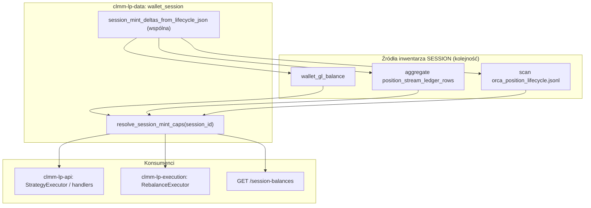

# Plan wdrożenia: cykl życia pozycji i reopen na wydzielonym portfelu sesji

**Status:** accepted (analiza + plan; implementacja po **`GO`**)  
**Data:** 2026-05-20  
**Decyzja produktowa:** cały cykl życia pozycji (open → LP → collect → close → swap → reopen) oraz **reopen** mają operować na **logicznym portfelu sesji** `SESSION:{rebalance_session_id}` / `cost_session_id`, a nie na nieograniczonym saldzie wspólnego portfela on-chain (wyjście z domyślnej **policy 3A** dla **decyzji o wielkości i kapsach**, niekoniecznie z osobnego keypaira).

**Powiązane:** [`WALLET_GL.md` §2.2](WALLET_GL.md#22-konto-logiczne-per-cykl-życia-pozycji-rebalance_session_id--norma-docelowa), [`WALLET_SESSION_GL_IMPLEMENTATION_PLAN.md`](WALLET_SESSION_GL_IMPLEMENTATION_PLAN.md) (faza 5), [`WALLET_SESSION_GL_INTEGRATION_ANALYSIS.md`](WALLET_SESSION_GL_INTEGRATION_ANALYSIS.md), [`FUNCTIONAL_SPECIFICATION.md`](FUNCTIONAL_SPECIFICATION.md) §2, §5.2, §6.1, [`DATA_CATALOG.md`](DATA_CATALOG.md)

**keywords:** SESSION capital, executor, reopen, policy-3A, session-cap, logical portfolio, rebalance_session_id, phase-5, WALLET_SESSION_CAPITAL_EXECUTOR_PLAN

---

## 1. Streszczenie

| Aspekt | Dziś (2026-05-20) | Docelowo (ten plan) |
| ------ | ----------------- | ------------------- |
| Księga SESSION | ✅ GL + PSLR + API + UI (shadow) | Bez zmian — **źródło inwentarza** |
| Budżet USD reopen **`T`** | Lifecycle §6.1 (`returned_*_raw`) | Bez zmian (spójne z SESSION po posting) |
| Kapsy swap/open | **Cały portfel RPC** | **`min(RPC, SESSION)`** per mint |
| Porównanie §2.2 **`W` vs `T`** | `W` = globalny portfel | **`W_session`** z SESSION (globalny tylko kontrola) |
| Brak SESSION / pusty | Fallback wallet-cap | Jawna ścieżka: pending-open / alert, **bez** cichego open z cudzej sesji |
| On-chain | Jeden signer (3A fizycznie) | Nadal jeden signer; izolacja **logiczna** (poziom **5a**) |

**Poza zakresem v1:** twarda rezerwacja on-chain / escrow / osobny keypair per sesja (**5b**).

---

## 2. Semantyka „wydzielonego portfela”

### 2.1 Co to jest

- **Konto logiczne:** `SESSION:{uuid}` w PG (`wallet_gl_balance` per `mint`).
- **Identyfikator:** `rebalance_session_id` (bot) ≡ `cost_session_id` (ręczny flow) ≡ `session_id` w GL.
- **Inwentarz sesji:** suma skorygowanych delt z lifecycle (open ujemne, close/collect/swap dodatnie/ujemne wg reguł w [`WALLET_SESSION_GL_INTEGRATION_ANALYSIS.md` §6](WALLET_SESSION_GL_INTEGRATION_ANALYSIS.md#6-reguła-liczenia-δ-na-session-jedna-funkcja-wielu-konsumentów)).
- **Retention:** po close pozycji SESSION **nie jest zamykany** — historia zostaje; **nowy cykl = nowy UUID**.

### 2.2 Czego to nie jest

- Nie zastępuje **banku on-chain** — SPL nadal na tych samych ATA.
- Nie blokuje fizycznie transferów innej strategii (bez **5b**).
- Nie zastępuje od razu **`GET /wallets/effective-balances`** dla **całego** UI portfela (§5 spec) — tylko ścieżki **związane z sesją**.

### 2.3 Poziom izolacji (wybór na wdrożenie)

| Poziom | Opis | Ten plan |
| ------ | ---- | -------- |
| **5a — logiczny cap** | Executor planuje open/reopen tylko w granicach SESSION; on-chain może nadal współdzielić ATA | **✅ v1** |
| **5b — twarda rezerwacja** | Lock mintów / sub-wallet / escrow | ❌ osobny projekt |

---

## 3. Luka implementacyjna (dowody w kodzie)

### 3.1 Executor (`clmm-lp-execution`)

| Funkcja / ścieżka | Plik | Zachowanie dziś |
| ----------------- | ---- | ---------------- |
| Kapsy depozytu | `open_wallet_notional_and_caps_sol_first` | `cap_a/b` = RPC (+ SOL-first) |
| `T` / swap-mix | `ensure_swap_mix_for_rebalance_open` | `prev_end` z `returned_*` w pamięci lub lifecycle |
| §2.2 refresh | `wallet_notional_refresh_until_reopen_target_met` | `W` = **globalny** notional |
| Rotacja | `execute` → `open_new_range_with_wallet_mix` | Po close: globalne kapsy |
| Pending-open | `recover_open_after_incomplete` | `close_amounts_from_lifecycle_best_effort` → globalne kapsy |
| Preflight close | `target_usd_for_close_reopen_preflight` | `wallet_notional_before_close` globalne |

`crates/execution/Cargo.toml` — **brak** zależności od `clmm-lp-data` / Postgres.

### 3.2 API / bot (`clmm-lp-api`)

- `StrategyExecutor` → `RebalanceExecutor` — **nie** przekazuje sald SESSION.
- `wallet_gl_posting::read_session_balances_resolved` — tylko HTTP + ingest; **nie** konsumowany przez execution.

### 3.3 CLI (`orca-bot-run`, `RebalanceExecutor` bez API)

- Odczyt lifecycle z pliku: `close_amounts_from_lifecycle_best_effort` (tylko **ostatni close**, nie pełny inwentarz sesji).
- Brak PG — wymaga **agregacji z JSONL** (ta sama reguła Δ co PSLR).

### 3.4 UI (ręczny open)

- `PositionCreate` — preflight na **`effective-balances`**, nie `session-balances`.
- `cost_session_id` jest wysyłany do journal — SESSION rośnie po ingest, ale **UI nie ogranicza** open do sesji.

---

## 4. Architektura docelowa



### 4.1 Rekomendacja: moduł współdzielony `clmm-lp-data`

**Przenieść / wyekstrahować** z `crates/api/src/services/wallet_gl_posting.rs`:

- `session_mint_deltas_from_lifecycle_json` (+ testy mapowania eventów),
- agregację po `session_id` (dziś `compute_session_balances_from_pslr`),
- odczyt GL (`read_session_balances`),
- **`resolve_session_mint_caps(db?, session_id, owner?) -> SessionMintCaps`**.

API zostaje cienkim wrapperem (HTTP, posting, reconcile). Execution i CLI wołają ten sam moduł — **jedna reguła Δ**.

**Alternatywa odrzucona na v1:** duplikat logiki Δ w `execution` — rozjazd z GL/PSLR.

### 4.2 Wstrzyknięcie do executora (bez sqlx w `execution`)

Nowy typ w `clmm-lp-execution` (lub `clmm-lp-domain`):

```rust
/// Per-mint spendable cap for this rebalance session (logical portfolio).
pub struct SessionMintCaps {
    pub session_id: String,
    pub caps_by_mint: BTreeMap<String, u64>, // mint base58 -> raw (>=0 only for spend)
    pub source: SessionCapsSource, // Gl | Pslr | LifecycleFile | Empty
}

pub enum SessionCapsSource {
    Gl,
    PslrFallback,
    LifecycleFile,
    Empty,
}
```

`RebalanceExecutor` metody przyjmują `Option<&SessionMintCaps>`:

- `None` + flag off → zachowanie jak dziś (3A).
- `Some` + flag on → kapsy i `W_session` z SESSION.

**Ładowanie:**

| Ścieżka | Kto ładuje `SessionMintCaps` |
| ------- | ---------------------------- |
| API bot | `StrategyExecutor` przed `execute` / `recover_open` — `Database` + `owner` |
| CLI | helper w `execution` lub `cli`: skan JSONL przez `clmm-lp-data` bez DB |
| Testy | fixture JSONL + mock caps |

---

## 5. Reguły biznesowe (norma po wdrożeniu)

### 5.1 Kapsy tokenów (swap-mix + open)

Dla mintów **nóg puli** `token_mint_a`, `token_mint_b` (i WSOL przez SOL-first jak dziś):

```
cap_mint = min(rpc_spendable_raw(mint), session_balance_raw(mint))
```

- `session_balance_raw` tylko dla mintów obecnych w SESSION; brak wpisu → **0** (nie „∞”).
- Ujemne saldo SESSION (błąd księgi) → traktować jako **0** + log `session_cap_negative_clamped`.

### 5.2 Notional sesji **`W_session`**

- `W_session` = USD notional z **`SessionMintCaps`** (te same `p_a/p_b` co depozyt).
- §2.2: porównuj **`W_session >= T * (1 - ε)`**, nie globalne `W`.
- **Kontrola krzyżowa (telemetria):** loguj `wallet_notional_global`, `session_notional`, `target_usd`, `source`.

### 5.3 Budżet **`T`**

**Bez zmiany** priorytetu:

1. `returned_*_raw` z bieżącego close (pamięć),
2. lifecycle §6.1 (`close_amounts_from_lifecycle_*`),
3. opcjonalnie: `T` z notional SESSION **tylko** gdy (2) brak — **za flagą** `CLMM_REOPEN_SESSION_T_FROM_INVENTORY=1` (domyślnie off, żeby nie zmieniać §6.1 bez świadomej decyzji).

### 5.4 Brak / puste SESSION

| Sytuacja | Zachowanie (flag on) |
| -------- | -------------------- |
| SESSION pusty, lifecycle ma close | Użyj lifecycle do `T`; kapsy z lifecycle **tylko dla returned_*** lub pełny replay JSONL w tej sesji |
| Oba puste | **Nie** open z globalnego portfela — `session_capital_unknown` → pending-open |
| GL ≠ PSLR (`reconcile` fail) | Domyślnie: użyj **min(gl, pslr)** per mint + warn; opcjonalnie strict: `CLMM_REOPEN_SESSION_REQUIRE_RECONCILE=1` → abort |

### 5.5 Preflight „no close unless reopen feasible”

`target_usd_for_close_reopen_preflight` — po wdrożeniu:

- `post_close_spendable` ≈ `W_session_after_close` (nie `wallet_global + prev_end` bez sesji),
- gdzie `W_session_after_close` = SESSION po close **lub** symulacja: obecny SESSION + `prev_end` (jeśli close jeszcze nie w GL).

### 5.6 Policy 3A vs 5a

- **3A** pozostaje na warstwie **fizycznej** (jeden portfel).
- **5a** zmienia **normę decyzyjną executora** gdy `CLMM_REOPEN_USE_SESSION_CAPITAL=1`.
- Aktualizacja [`FUNCTIONAL_SPECIFICATION.md`](FUNCTIONAL_SPECIFICATION.md) §2.1 / §5.2: SESSION jako preferowane źródło `W` i kapsów (nie tylko shadow).

---

## 6. Plan faz (PR)

### Faza P0 — Shared library (bez zmiany zachowania bota)

| Zadanie | Pliki |
| ------- | ----- |
| Nowy moduł `crates/data/src/wallet_session.rs` | ekstrakcja Δ + aggregate + read GL |
| API: `wallet_gl_posting.rs` deleguje do `clmm-lp-data` | cienki wrapper |
| Testy przeniesione / rozszerzone | `bot_close`, `bot_open`, swap, collect, idempotencja |
| `SessionMintCaps` + `resolve_session_mint_caps` | public API data crate |

**Done:** `cargo test -p clmm-lp-data wallet_session`; API testy GL bez regresji.

---

### Faza P1 — Executor: kapsy `min(RPC, SESSION)`

| Zadanie | Pliki |
| ------- | ----- |
| `open_wallet_notional_and_caps_session_aware` | `rebalance.rs` |
| Param `session_caps: Option<&SessionMintCaps>` w `open_new_range_with_wallet_mix`, `ensure_swap_mix_for_rebalance_open` | `rebalance.rs` |
| Env `CLMM_REOPEN_USE_SESSION_CAPITAL` (default **`0`**) | dokumentacja |
| Lifecycle JSONL loader dla CLI | `wallet_session` lub `execution` helper |
| Logi: `session_cap_a_raw`, `session_cap_b_raw`, `rpc_cap_*` | lifecycle diagnostic |

**Done:** test jednostkowy: RPC=100, SESSION=40 → cap=40; flag off → cap=100.

---

### Faza P2 — Executor: §2.2 na `W_session`

| Zadanie | Pliki |
| ------- | ----- |
| `wallet_notional_refresh_until_reopen_target_met` → `session_notional` | `rebalance.rs` |
| `recover_open_after_incomplete` ładuje caps po `rebalance_session_id` | `rebalance.rs`, `executor.rs` |
| `execute` po close przekazuje caps do open | `rebalance.rs` |
| Diagnostic `bot_reopen_session_below_target` (obok `bot_reopen_wallet_below_target`) | `tx_lifecycle.rs` |
| `bot_open_position.details`: `session_notional_usd`, `session_caps_source` | lifecycle append |

**Done:** integracyjny test z mock caps + flag on → błąd gdy SESSION < T.

---

### Faza P3 — API bot: podłączenie DB

| Zadanie | Pliki |
| ------- | ----- |
| `StrategyExecutor` / `strategy_service`: `resolve_session_mint_caps` przed rebalance | `strategy_service.rs`, `executor.rs` |
| `position_executor` (ręczny rebalance przez API) — ten sam hook | `position_executor.rs` |
| Gdy DB offline: jawny fallback (flag) lub skip session mode | log + `session_caps_source=db_unavailable` |

**Done:** dry-run strategii z DB + session_id loguje caps w trace.

---

### Faza P4 — UI ręczny open (opcjonalnie w tym samym PR lub +1)

| Zadanie | Pliki |
| ------- | ----- |
| `PositionCreate`: gdy `cost_session_id` — preflight vs `getWalletSessionBalances` | `PositionCreate.tsx`, `api.ts` |
| Komunikat: „open przekracza kapitał sesji” | i18n |
| Nie zastępuje globalnego salda — pokazuje oba | UX |

---

### Faza P5 — Dokumentacja i rollout

| Zadanie | Pliki |
| ------- | ----- |
| §2.1 / §5.2 functional spec | `FUNCTIONAL_SPECIFICATION.md` |
| Faza 5 plan GL ✅ | `WALLET_SESSION_GL_IMPLEMENTATION_PLAN.md` |
| DATA_CATALOG env | `DATA_CATALOG.md` |
| ENGINEERING_NOTES wpis | po merge kodu |
| Runbook: włączenie flagi, reconcile przed produkcją | `ORCA_RUNBOOK.md` lub `WALLET_GL.md` |

**Rollout:** devnet `CLMM_REOPEN_USE_SESSION_CAPITAL=1` → obserwacja telemetrii → mainnet.

---

## 7. Zmienne środowiskowe (propozycja)

| Env | Domyślnie | Znaczenie |
| --- | --------- | --------- |
| `CLMM_REOPEN_USE_SESSION_CAPITAL` | `0` | `1` = kapsy + §2.2 na SESSION (5a) |
| `CLMM_REOPEN_SESSION_REQUIRE_RECONCILE` | `0` | `1` = przerwij gdy GL ≠ PSLR |
| `CLMM_REOPEN_SESSION_T_FROM_INVENTORY` | `0` | `1` = fallback `T` z pełnego SESSION gdy brak close w lifecycle |
| `CLMM_REOPEN_SESSION_STRICT_EMPTY` | `1` | `1` = brak SESSION → nie używaj globalnego portfela do open |

Istniejące bez zmian: `CLMM_REOPEN_WALLET_REFRESH_*`, `CLMM_PENDING_OPEN_*`, `CLMM_WALLET_GL_SESSION_*`.

---

## 8. Testy i kryteria akceptacji

### 8.1 Testy automatyczne

| Obszar | Typ | Stan |
| ------ | --- | ---- |
| Mapowanie Δ lifecycle → SESSION | unit (`clmm-lp-data` + `wallet_gl_posting`) | ✅ |
| Agregacja close+open, JSONL caps, `gl_pslr_match`, `resolve` bez DB | unit (`wallet_session`) | ✅ 2026-05-20 |
| `load_session_mint_caps` (flag, strict empty, JSONL) | unit tokio (`session_capital`) | ✅ 2026-05-20 |
| `min(rpc, session)` caps | unit (`execution` `cap_rpc_with_session`) | ✅ |
| `apply_session_caps_to_wallet_raw` | unit (`rebalance`) | ✅ 2026-05-20 |
| `session_capital_error_if_strict` | unit (`rebalance`) | ✅ 2026-05-20 |
| `W_session < T` → error / pending | unit + fixture | ❌ (E2E / mock RPC) |
| API resolve z PG | integracja DB | ❌ |
| Regresja flag off | unit | ✅ |

### 8.2 Kryteria E2E (operator)

1. Cykl z jednym `rebalance_session_id`: close → ingest → `GET session-balances` pokazuje minty.
2. `reconcile-session-gl` → `gl_matches_pslr=true`.
3. Z flagą on: reopen nie używa tokenów **poza** SESSION (test: druga sesja zużyła globalny portfel — reopen sesji A **nie** otwiera na kapitał B).
4. Pending-open po `session_below_target` — ponawianie gdy SESSION rośnie (np. po backfill).

---

## 9. Ryzyka i mitigacje

| Ryzyko | Mitigacja |
| ------ | --------- |
| Opóźnienie ingest → puste GL | Fallback PSLR / JSONL; backfill; `source` w logach |
| GL ≠ PSLR | Reconcile endpoint; strict flag; min(gl,pslr) |
| CLI bez DB | Agregacja JSONL (P0) |
| „Fałszywy” SESSION przez błędny `session_id` | UI wymusza UUID; walidacja przy open |
| Operator transferuje tokeny ręcznie | SESSION nie widzi → `W_session` niskie → pending (oczekiwane) |
| Regresja strategii produkcyjnych | Flaga domyślnie **off**; rollout stopniowy |
| Ujemne saldo SESSION (błąd księgi) | clamp 0 + alert reconcile |

---

## 10. Czego nie robimy w tym planie

- Osobny keypair / vault per sesja (**5b**).
- Zastąpienie `effective-balances` w całym UI.
- Auto-zamykanie / likwidacja `SESSION:*` po close.
- Zerowanie SESSION po successful open.
- Blokada on-chain transferów między sesjami.

---

## 11. Kolejność PR (skrót)

```text
P0  shared wallet_session w clmm-lp-data (refactor API)
P1  executor caps min(rpc, session) + env flag (default off)
P2  W_session §2.2 + lifecycle telemetry
P3  API StrategyExecutor wires DB
P4  UI PositionCreate preflight (optional)
P5  docs + spec §2.1/§5.2 + rollout notes  ✅ (WALLET_GL §6)
```

Szacunek: **P0–P2** = rdzeń produktowy; **P3** wymagany dla bota API; **P4** dla ręcznego open; CLI pokryte w P0+P1 przez JSONL.

---

## 12. Decyzje do potwierdzenia przed `GO`

| # | Pytanie | Rekomendacja planu |
| - | ------- | ------------------ |
| 1 | Poziom izolacji | **5a** (logiczny cap) |
| 2 | Domyślna flaga po wdrożeniu | **off** do ręcznego włączenia na mainnet |
| 3 | GL ≠ PSLR | **min(gl,pslr)** + warn; strict opcjonalny |
| 4 | Fallback `T` z pełnego SESSION | **off** (§6.1 bez zmian) |
| 5 | Ręczny UI w tym samym rollout co bot | tak, **P4** — inaczej ręczny open omija sesję |

---

## 13. Changelog

| Data | Zmiana |
| ---- | ------ |
| 2026-05-20 | Utworzenie planu wdrożenia executor + shared data (analiza luki 3A vs norma §2.2) |
